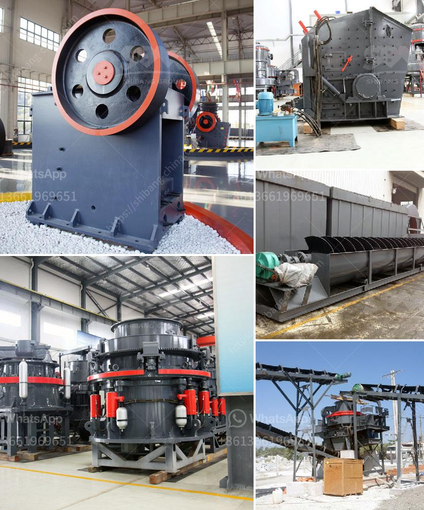

<h3>calcite costing of processing equipment</h3>
Calcite is a widely used mineral in various industries due to its unique properties. It is a transparent or translucent mineral, often found in sedimentary rocks, and has a wide range of applications such as in construction, paint, paper, and pharmaceuticals. However, in order to use calcite in these industries, it needs to be processed using specialized equipment.

The cost of processing equipment for calcite can vary depending on the size and functionality of the equipment. Generally, larger equipment with more advanced features will have a higher cost. For instance, a small calcite processing machine with a simple design may cost around $10,000, while a larger, more sophisticated machine that can handle a higher volume of calcite may cost upwards of $100,000.

Apart from the size and functionality, the quality of materials used in the construction of the equipment can also impact the cost. A machine made with high-quality materials and components is likely to have a higher price tag due to its durability and longevity.

Furthermore, the brand of the equipment can also influence its cost. Well-established brands that have a reputation for producing reliable and efficient machines may charge a premium for their products. However, opting for a reputable brand can often be a wise investment in the long run, as it ensures better performance and reduces the risk of breakdowns.

It's worth noting that the cost of processing equipment is not limited to the initial purchase price. Other factors such as operation and maintenance costs, energy consumption, and potential repairs also need to be considered while calculating the total cost of ownership.

In conclusion, the cost of processing equipment for calcite can vary widely depending on factors such as size, functionality, materials used, and brand. It is crucial for industries that rely on calcite to conduct thorough research, compare prices, and evaluate the long-term benefits in order to make an informed decision about the most suitable equipment for their specific needs.
<h3>Contact us</h3><ul><li><strong>Whatsapp:&nbsp;<a href="https://wa.me/8613661969651">+8613661969651</a></strong></li><li><a href="https://swt.shibang-china.com/?git&amp;zhl&amp;calcite costing of processing equipment"><strong>Online Service(chat now)</strong></a></li></ul><h3>Related</h3><ul><li><a href='super fine grinding machine in sri lanka.md'>super fine grinding machine in sri lanka</a></li><li><a href='mobile rock crushers in ghana.md'>mobile rock crushers in ghana</a></li><li><a href='types of stone crusher with different output size.md'>types of stone crusher with different output size</a></li><li><a href='industrial mills in mexico.md'>industrial mills in mexico</a></li><li><a href='jaw crusher price saudi.md'>jaw crusher price saudi</a></li></ul>