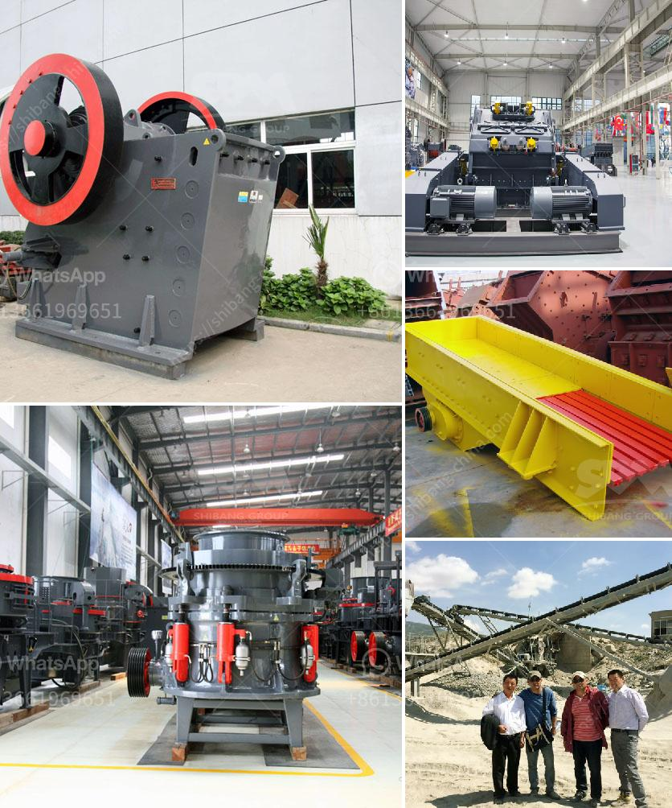

<h3>calcium carbide plant and machinery</h3>
Calcium carbide is a chemical compound that is primarily used in the production of acetylene gas, which is used in various industries for a wide range of applications. The chemical formula for calcium carbide is CaC2.

To manufacture calcium carbide, the chemical reaction between calcium oxide (CaO) and carbon (C) needs to take place at extremely high temperatures, typically exceeding 2,200 degrees Celsius. This reaction is conducted in specialized plants equipped with various machinery and equipment, specifically designed for efficient production.

The machinery involved in the calcium carbide production process typically includes crushers, furnaces, feeders, conveyors, generators, and various other types of equipment. These machines work together to carve out this useful chemical compound from its raw materials.

The first step in the production of calcium carbide involves the crushing of limestone, a commonly found sedimentary rock that contains calcium carbonate (CaCO3). Large limestone rocks are crushed into smaller sizes using crushers. The crushed limestone is then mixed with a set amount of carbon in the form of coke or anthracite coal. This mixture serves as the feedstock for the subsequent chemical reaction.

The next crucial step in the production process is the feeding of the limestone and carbon mixture into specialized furnaces. These furnaces play a critical role in reaching the extremely high temperatures required for the chemical reaction to occur. The furnaces are designed to withstand these high temperatures without damage, ensuring the safe and efficient production of calcium carbide.

Once inside the furnaces, the limestone and carbon mixture is heated to around 2,200 degrees Celsius. At this temperature, the carbon combines with the calcium oxide, resulting in the formation of calcium carbide and carbon monoxide gas. This chemical reaction is highly exothermic, meaning it releases a large amount of heat.

After the chemical reaction is complete, the mixture is extracted from the furnaces and cooled down. The solidified calcium carbide is then broken into smaller pieces and transported to storage facilities.

Throughout the production process, various types of machinery and equipment aid in the smooth operation of the calcium carbide plant. Conveyors are used to transport the raw materials and the final product between different stages of the production line. Generators provide the power required for the machinery to function, ensuring uninterrupted production. Feeders are used to control the flow of materials into the furnaces, maintaining a consistent and efficient process.

The calcium carbide plant and machinery undergo regular maintenance to ensure optimal performance. This includes routine inspections, cleaning, and repair works. Adequate safety measures are also in place to protect workers from the high temperatures and potential hazards associated with the production process.

In conclusion, the production of calcium carbide is a complex process that relies on a range of specialized machinery and equipment. The carefully designed plant and machinery facilitate the chemical reactions required to manufacture calcium carbide efficiently. These operations contribute to the availability of acetylene gas, which plays a crucial role in various industrial applications, such as welding and metal cutting.
<h3>Contact us</h3><ul><li><strong>Whatsapp:&nbsp;<a href="https://wa.me/8613661969651">+8613661969651</a></strong></li><li><a href="https://swt.shibang-china.com/?git&amp;zhl&amp;calcium carbide plant and machinery"><strong>Online Service(chat now)</strong></a></li></ul><h3>Related</h3><ul><li><a href='companies of roller mills.md'>companies of roller mills</a></li><li><a href='used jaw crusher machine for sale nepal.md'>used jaw crusher machine for sale nepal</a></li><li><a href='cone crushers washing system.md'>cone crushers washing system</a></li><li><a href='used washing gold plants for sale in europe.md'>used washing gold plants for sale in europe</a></li><li><a href='magnesite processing equipment price.md'>magnesite processing equipment price</a></li></ul>