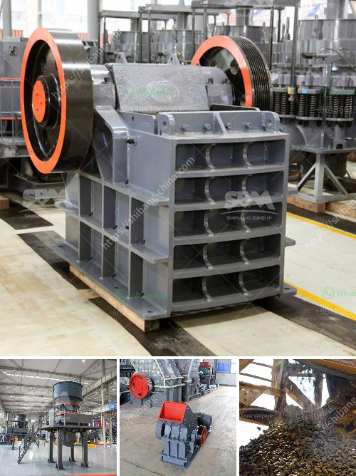

<h3>calcium carbonate milling plant in turkey</h3>
Turkey is one of the fastest-growing economies in the world and its construction sector is a major contributor to the country's economy. With a total GDP of $1.8 trillion in 2020, Turkey is also one of the largest producers of construction materials in the region. One such material gaining significant popularity in recent years is calcium carbonate.

Calcium carbonate is a versatile mineral used in a variety of industries, including construction, paper, plastics, and paint. Its ability to enhance the properties of various products makes it a sought-after material. As the demand for calcium carbonate continues to rise, companies are establishing milling plants to cater to the growing market.

Turkey, with its abundant mineral resources, is an ideal location for calcium carbonate milling plants. The country boasts large deposits of high-quality calcium carbonate, making it an attractive investment opportunity for both local and foreign companies. These milling plants process the calcium carbonate into various grades and particle sizes, depending on the market requirements.

One of the key advantages of establishing a calcium carbonate milling plant in Turkey is the proximity to end-users. Turkey's construction industry, for instance, is a major consumer of calcium carbonate for the production of concrete additives and building materials. Having a local milling plant allows for cost-effective and efficient supply to the construction companies.

Additionally, Turkey's geographical location provides a strategic advantage for exporting calcium carbonate to neighboring countries in Europe, Asia, and the Middle East. The country's well-developed transportation infrastructure facilitates easy access to international markets, making it a preferred hub for calcium carbonate exports.

Moreover, the Turkish government has been actively promoting foreign investments in the country's mining and manufacturing sectors. This has created a favorable business environment, encouraging companies to establish calcium carbonate milling plants in Turkey. Capitalizing on the government support, companies can easily obtain the necessary permits and licenses for setting up and operating milling plants.

In conclusion, the calcium carbonate milling plant market in Turkey is witnessing rapid growth due to the country's booming construction sector and favorable investment climate. Turkey's abundant mineral deposits, proximity to end-users, and strong export potential make it an attractive destination for companies looking to establish milling plants. As the demand for calcium carbonate continues to rise, investments in the Turkish market are poised to reap significant rewards.
<h3>Contact us</h3><ul><li><strong>Whatsapp:&nbsp;<a href="https://wa.me/8613661969651">+8613661969651</a></strong></li><li><a href="https://swt.shibang-china.com/?git&amp;zhl&amp;calcium carbonate milling plant in turkey"><strong>Online Service(chat now)</strong></a></li></ul><h3>Related</h3><ul><li><a href='machinery for bentonite crusher production.md'>machinery for bentonite crusher production</a></li><li><a href='fine powder grinding mill.md'>fine powder grinding mill</a></li><li><a href='quarry plant equipment.md'>quarry plant equipment</a></li><li><a href='sand manufacturing machines china.md'>sand manufacturing machines china</a></li><li><a href='jaw crushers for sale in zimbabwe.md'>jaw crushers for sale in zimbabwe</a></li></ul>