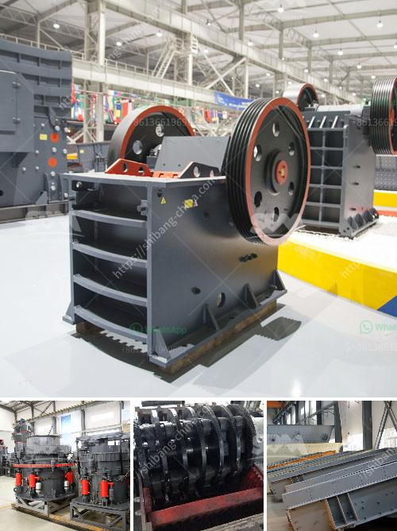

<h3>calcium carbonate plants in qatar</h3>
Calcium carbonate plants in Qatar play a crucial role in the country's industrial development. Qatar is known for its immense reserves of oil and gas, making it one of the wealthiest countries in the world. However, in recent years, there has been a concerted effort to diversify the economy and reduce dependence on fossil fuels. One sector that has seen significant growth in this diversification process is the manufacturing industry, with calcium carbonate plants at the forefront.

Calcium carbonate, a chemical compound with the formula CaCO3, is widely used in various industries due to its versatile properties. It is an essential raw material for the production of cement, plastics, paints, papers, and many other products. The demand for calcium carbonate is steadily increasing worldwide, and Qatar has recognized the opportunity to leverage its abundant limestone reserves to meet this demand.

Qatar possesses vast limestone deposits that are spread across its different regions. These limestone deposits are the primary source of calcium carbonate for the country's manufacturing plants. The limestone is excavated from quarries using heavy machinery, and then it is transported to the calcium carbonate plants.

The process of producing calcium carbonate involves various stages. The limestone is first crushed into smaller fragments and then undergoes a series of grinding and milling processes to achieve the desired particle size and purity. The resulting calcium carbonate powder is then subjected to further treatments to enhance its properties, such as surface coating or modifying the particle shape. These additional processes ensure that the calcium carbonate produced in Qatar meets the stringent quality requirements of its end-users.

In recent years, Qatar has made significant investments in calcium carbonate plants to foster the development of a robust manufacturing sector. These plants not only cater to the growing domestic demand but also contribute to the country's exports. By producing high-quality calcium carbonate, Qatar can supply not only the local industries but also foreign markets, generating revenue and facilitating economic growth.

Furthermore, calcium carbonate plants in Qatar contribute to environmental sustainability. By utilizing locally available limestone reserves, the need to import calcium carbonate from distant locations is reduced, resulting in lower carbon emissions associated with transportation. Additionally, the production process incorporates advanced technologies that minimize energy consumption and waste generation, making it an environmentally friendly operation.

The development of calcium carbonate plants in Qatar is aligned with the country's broader goals of economic diversification, job creation, and sustainable industrial growth. These plants are not only instrumental in meeting the domestic demand for calcium carbonate but also position Qatar as a regional player in the manufacturing industry. With its abundant limestone reserves and the continuous support from the government, the calcium carbonate sector is expected to flourish in Qatar, making a significant contribution to its economy for years to come.

In conclusion, calcium carbonate plants in Qatar have emerged as key players in the country's industrial development. With its abundant reserves of limestone, Qatar is well-positioned to meet the growing demand for calcium carbonate. These plants offer a sustainable and environmentally friendly solution for supplying calcium carbonate to both domestic and international markets, thus supporting the country's efforts towards economic diversification and sustainable growth.
<h3>Contact us</h3><ul><li><strong>Whatsapp:&nbsp;<a href="https://wa.me/8613661969651">+8613661969651</a></strong></li><li><a href="https://swt.shibang-china.com/?git&amp;zhl&amp;calcium carbonate plants in qatar"><strong>Online Service(chat now)</strong></a></li></ul><h3>Related</h3><ul><li><a href='sells hammer mills in zimbabwe.md'>sells hammer mills in zimbabwe</a></li><li><a href='crushers made in south philippines.md'>crushers made in south philippines</a></li><li><a href='process flow of bajri washing plant.md'>process flow of bajri washing plant</a></li><li><a href='cement grinding mill price invest cost.md'>cement grinding mill price invest cost</a></li><li><a href='gypsum chromium limestone mining.md'>gypsum chromium limestone mining</a></li></ul>