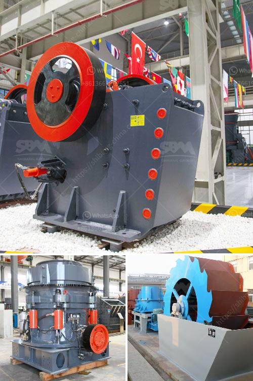

<h3>calcium carbonate powder crushing crusher usa</h3>
Calcium carbonate is a compound found widely in nature, making it an indispensable mineral for various industries. It is usually mined from the earth or extracted from natural sources such as limestone, marble, and chalk. Once extracted, calcium carbonate is processed into a finely ground powder known as calcium carbonate powder.

Calcium carbonate powder finds extensive use in industries such as construction, agriculture, pharmaceuticals, and more. In order to obtain this finely ground powder, crushers play a vital role. Crushers are equipment used to reduce the size of larger materials into smaller ones, making them easier to handle and process.

The United States is a significant producer and consumer of calcium carbonate powder. With a wide range of applications, the demand for calcium carbonate powder is expected to witness steady growth in the coming years. The crushing process helps to convert the raw material into the desired particle size, ensuring optimal usability.

When it comes to crushing calcium carbonate powder, crushers in the USA are widely used due to their efficiency and reliability. These crushers are designed to break down the mineral into smaller sizes, allowing for easier handling and transportation. With a wide range of crusher models available, they can cater to different production requirements.

One of the commonly used crushers in the crushing process for calcium carbonate powder is the jaw crusher. It is known for its high reduction ratio and large feed opening size, making it suitable for primary crushing. The jaw crusher applies force to break the mineral into smaller pieces, resulting in more manageable fragments.

In addition to jaw crushers, impact crushers are also commonly used in the crushing process. Impact crushers utilize high-speed rotating rotors to strike the mineral, breaking it into smaller particles. This type of crusher is particularly useful for producing a well-defined shape and size distribution of the final product.

Cone crushers are another popular choice for crushing calcium carbonate powder. It uses a rotating mantle and a stationary concave to break down the mineral. Cone crushers are suitable for producing a variety of particle sizes, making them versatile in different applications.

Choosing the right crusher for calcium carbonate powder crushing plays a crucial role in determining the quality and suitability of the final product. Factors such as the hardness of the mineral, desired particle size, and production capacity should be considered before selecting the appropriate crusher.

The crushing process is a significant step in the production of calcium carbonate powder. It ensures that the mineral is broken down into the desired particle size, making it easier to handle and process. Proper crushing techniques can also enhance the properties and performance of the final product.

In conclusion, calcium carbonate powder crushing is an essential process in various industries, and crushers play a vital role in this process. The United States, being a major consumer and producer of calcium carbonate powder, relies on efficient and reliable crushers to meet the growing demand. Choosing the right crusher is crucial to ensure high-quality products and maximize efficiency.
<h3>Contact us</h3><ul><li><strong>Whatsapp:&nbsp;<a href="https://wa.me/8613661969651">+8613661969651</a></strong></li><li><a href="https://swt.shibang-china.com/?git&amp;zhl&amp;calcium carbonate powder crushing crusher usa"><strong>Online Service(chat now)</strong></a></li></ul><h3>Related</h3><ul><li><a href='crushing milling machine for graphite powder.md'>crushing milling machine for graphite powder</a></li><li><a href='crushing of calcined bauxite.md'>crushing of calcined bauxite</a></li><li><a href='quarry crusher equipment made in turkey.md'>quarry crusher equipment made in turkey</a></li><li><a href='latest stone crusher machine price india.md'>latest stone crusher machine price india</a></li><li><a href='fine powder mill.md'>fine powder mill</a></li></ul>