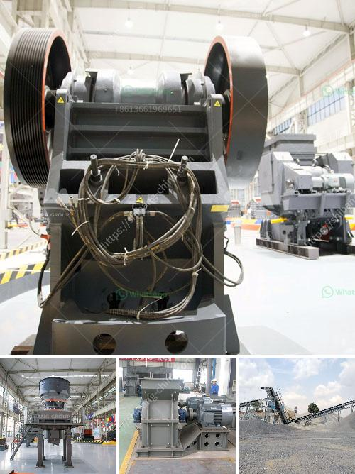

<h3>calcium carbonate powder making equipment in germany</h3>
Calcium carbonate is a chemical compound widely used in various industries. It is an essential ingredient in the manufacturing of cement, plastics, rubber, paper, paints, and coatings. Calcium carbonate is also used in dietary supplements, and its market demand is continuously rising. With the increasing demand, there is a need for efficient calcium carbonate powder making equipment.

In Germany, the calcium carbonate manufacturers use advanced technology to produce high-quality calcium carbonate powder. There are numerous grinding plants that are specifically used for grinding calcium carbonate. In these grinding plants, modern equipment like grinding mills, classifiers, and related accessories are used to ensure increased production and efficiency.

Grinding mills are used to pulverize calcium carbonate particles. The fineness of the ground calcium carbonate can vary widely depending on the application. A calcium carbonate grinding mill is a type of machinery used to grind various calcium carbonate minerals into very fine powder. The final product can be used in many different industries such as paint, rubber, plastics, construction materials, etc.

Classifiers are an essential part of calcium carbonate production lines. They help in effectively separating the ground calcium carbonate particles based on their sizes. These classifiers use airflow to separate the particles, ensuring that each particle meets the required size specifications. This allows manufacturers to produce calcium carbonate of different particle sizes to cater to different industry demands.

In addition to grinding mills and classifiers, there is a range of ancillary equipment used in calcium carbonate powder making plants in Germany. Some of the most common ones include conveyors, bucket elevators, storage silos, and dust collectors. These pieces of equipment work together to ensure smooth operation and efficient production of high-quality calcium carbonate powder.

The calcium carbonate powder making equipment in Germany has the advantages of high efficiency, environmental protection, low noise, low operating cost, simple operation, and maintenance. In addition, the final product has good quality and high whiteness, suitable for various industries' needs.

One of the primary advantages of German equipment is the use of advanced technology. German manufacturers are known for their innovation and constant research and development. This ensures that the calcium carbonate powder making equipment is at the forefront of technology, leading to higher efficiency and better performance.

Furthermore, German equipment ensures a higher level of automation, reducing the need for manual labor and minimizing the risk of human errors. This not only improves the quality of the final product but also reduces production costs.

In conclusion, calcium carbonate is a versatile compound used in various industries, and the demand for it is continuously increasing. Germany is known for its advanced technological equipment for calcium carbonate powder production. With the use of grinding mills, classifiers, and associated machinery, German manufacturers are able to produce high-quality calcium carbonate powder efficiently. The use of advanced technology, coupled with automation and the availability of ancillary equipment, ensures a smooth and efficient manufacturing process. German calcium carbonate powder making equipment is known for its reliability, durability, and consistent performance, making it the preferred choice for many manufacturers in the industry.
<h3>Contact us</h3><ul><li><strong>Whatsapp:&nbsp;<a href="https://wa.me/8613661969651">+8613661969651</a></strong></li><li><a href="https://swt.shibang-china.com/?git&amp;zhl&amp;calcium carbonate powder making equipment in germany"><strong>Online Service(chat now)</strong></a></li></ul><h3>Related</h3><ul><li><a href='list of limestone mining companies in china.md'>list of limestone mining companies in china</a></li><li><a href='how does a jaw crusher limestone.md'>how does a jaw crusher limestone</a></li><li><a href='crusher for pozzuolana.md'>crusher for pozzuolana</a></li><li><a href='grinding mill price in.md'>grinding mill price in</a></li><li><a href='china quarry crushing production line equipment.md'>china quarry crushing production line equipment</a></li></ul>