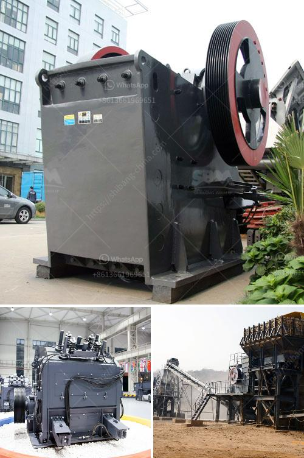

<h3>calcium carbonate powder making machine</h3>
Calcium carbonate powder making machine is used in the manufacture of calcium carbonate particles or powders. Calcium carbonate is a versatile material, widely used in many industries such as construction, paint, papermaking, plastics, rubber, ceramics, etc. It is a common filler and additive in various products, and its production has become a booming industry.

To produce calcium carbonate powder, the raw material limestone or marble is first crushed into small particles. Then, a series of grinding and classifying processes are conducted to achieve the desired particle size. The grinding process is usually done using a mill or a roller mill. The final product is collected in a cyclone separator or a bag filter.

There are several types of grinding machines that can be used for this purpose, including Raymond mill, high-pressure grinding mill, ultrafine grinding mill, ball mill, and vertical roller mill. Each mill has its own unique features and advantages, depending on the specific requirements of the production process.

Raymond mill is a commonly used machine for milling equipment. After the material is crushed, it is fed into the grinding chamber of the main machine, and the grinding roller swings outward due to the centrifugal force during rotation. Under the action of the high-pressure spring and the centrifugal force, the grinding roller is tightly pressed against the grinding ring, achieving the purpose of milling.

The high-pressure grinding mill is an advanced grinding machine that uses a pressure-driven grinding method. It can process limestone, gypsum, coal gangue, slag, etc., and has high grinding efficiency and good product fineness. The equipment has high pressure and large capacity, and the power consumption is relatively low.

The ultrafine grinding mill is a fine-grinding equipment specialized in the deep processing of non-metallic minerals. It produces high-quality calcium carbonate powder with good whiteness and purity. It has the advantages of high grinding efficiency, low energy consumption, and low investment cost.

The ball mill is a commonly used equipment for calcium carbonate grinding. The material is mainly ground by the impact between the grinding medium and the material. The grinding medium can be steel balls, steel bars, or gravel. It has good overall performance, large processing capacity, high efficiency, and energy saving. 

The vertical roller mill is a new type of grinding machine that can effectively improve the grinding efficiency and processing capacity of calcium carbonate. It uses a grinding roller and a grinding ring to achieve crushing, grinding, and powder selection. The finished product has good quality, uniform particle size, and low iron content.

In conclusion, calcium carbonate powder making machine plays a vital role in the production of calcium carbonate particles or powders. The choice of grinding machine will depend on various factors, such as the required product fineness, production capacity, investment cost, and operating cost. By selecting the right equipment and optimizing the production process, manufacturers can produce high-quality calcium carbonate products to meet the diverse needs of different industries.
<h3>Contact us</h3><ul><li><strong>Whatsapp:&nbsp;<a href="https://wa.me/8613661969651">+8613661969651</a></strong></li><li><a href="https://swt.shibang-china.com/?git&amp;zhl&amp;calcium carbonate powder making machine"><strong>Online Service(chat now)</strong></a></li></ul><h3>Related</h3><ul><li><a href='jaw crusher terminator.md'>jaw crusher terminator</a></li><li><a href='production quarzt sand machine.md'>production quarzt sand machine</a></li><li><a href='ball mill manufacturers in malaysia.md'>ball mill manufacturers in malaysia</a></li><li><a href='used silica sand washing plant for sale.md'>used silica sand washing plant for sale</a></li><li><a href='roller mill spaider.md'>roller mill spaider</a></li></ul>