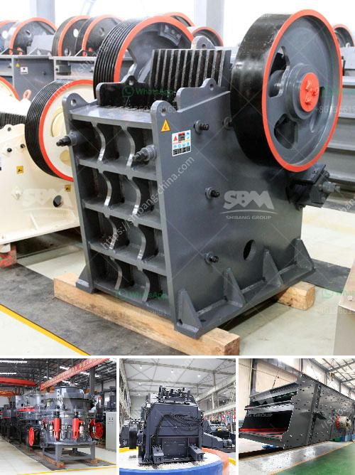

<h3>calculate grinding ball diameter for ball mill</h3>
Calculating the diameter of grinding balls for a ball mill is one of the most crucial steps in achieving efficient grinding. In the mining industry, grinding is an important process that relies on the breaking down of ores to separate valuable elements and minerals from waste rock. The grinding process is facilitated by the use of ball mills, which act as a rotating vessel with steel balls inside that grind the material to the desired fineness.

The diameter of the grinding balls used in ball mills is an important parameter that affects the efficiency of the grinding process. It is often determined by trial and error, using laboratory-scale tests, but it is also possible to estimate it using empirical formulas.

One commonly used formula to calculate the optimum diameter of grinding balls is the Bond formula, which proposes a proportional relationship between the diameter of the balls and the particle size of the material being ground. According to this formula, the optimum diameter of grinding balls can be calculated as:

- K is a constant that depends on the nature of the material being ground (e.g., for limestone, K = 3.54),

- C and F are correction factors that depend on the grinding conditions and can be determined experimentally.

To use this formula, one needs to know the desired final particle size of the material and estimate the volume fraction of solid in the slurry. The correction factors C and F can be determined by conducting grinding tests under different conditions and comparing the results with the desired particle size.

It is important to note that this formula provides an estimate of the optimum grinding ball diameter and may need to be adjusted based on the specific characteristics of the material being ground and the operating conditions of the ball mill. Therefore, it is advisable to conduct laboratory-scale tests to validate the calculated diameter before scaling up to industrial-scale mills.

In conclusion, calculating the diameter of grinding balls for a ball mill is a critical step in achieving efficient grinding. The Bond formula provides a useful estimate, but it should be validated through laboratory-scale tests. By optimizing the grinding ball diameter, mining operations can achieve better grinding efficiency, resulting in increased production and reduced energy consumption.
<h3>Contact us</h3><ul><li><strong>Whatsapp:&nbsp;<a href="https://wa.me/8613661969651">+8613661969651</a></strong></li><li><a href="https://swt.shibang-china.com/?git&amp;zhl&amp;calculate grinding ball diameter for ball mill"><strong>Online Service(chat now)</strong></a></li></ul><h3>Related</h3><ul><li><a href='size to a jaw crusher and cone crusher.md'>size to a jaw crusher and cone crusher</a></li><li><a href='portable concrete crusher for rent qatar.md'>portable concrete crusher for rent qatar</a></li><li><a href='stone crusher saudi.md'>stone crusher saudi</a></li><li><a href='stone crusher machine plant for sale in pakistan.md'>stone crusher machine plant for sale in pakistan</a></li><li><a href='coal fine pelletizing machine manufacturer india.md'>coal fine pelletizing machine manufacturer india</a></li></ul>