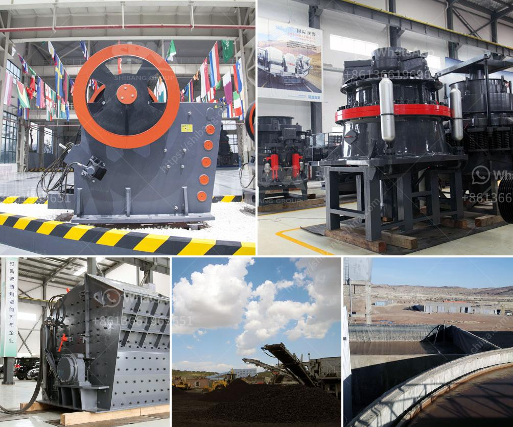

<h3>calculating capacity of a roll crusher</h3>
Calculating the capacity of a roll crusher is a relatively simple process. The formula for calculating the capacity of a roll crusher is given by

To calculate the capacity, we need to consider several factors relevant to the crushing process. These factors include the type and size of the material being crushed, the desired product size, and the desired throughput or production rate.

The type and size of the material being crushed play a crucial role in determining the capacity of the roll crusher. Different materials have different properties, such as density, hardness, and friability, which affect the crushing behavior. For example, a material with a high density and hardness would typically require a larger roll diameter and roll length to achieve the desired capacity.

The desired product size also influences the capacity of the roll crusher. Smaller product sizes require a higher crushing force and more efficient crushing action, which in turn requires a higher capacity. For example, if the desired product size is very fine, a smaller capacity roll crusher would not be able to achieve the desired reduction ratio.

The desired throughput or production rate is another crucial factor in determining the capacity of the roll crusher. The volumetric flow rate of the feed material, represented by Q in the formula, directly affects the capacity. A higher volumetric flow rate typically requires a higher capacity roll crusher to maintain the desired production rate.

In practice, it is important to consider all these factors when calculating the capacity of a roll crusher. This ensures that the crusher can handle the material, produce the desired product size, and meet the required production rate. It is also essential to consider any additional factors specific to the application, such as the operating conditions, maintenance requirements, and safety considerations.

In conclusion, calculating the capacity of a roll crusher involves considering several factors, including the type and size of the material being crushed, the desired product size, and the desired production rate. By considering these factors and using the appropriate formula, one can determine the capacity of a roll crusher and ensure that it meets the specific requirements of the crushing application.
<h3>Contact us</h3><ul><li><strong>Whatsapp:&nbsp;<a href="https://wa.me/8613661969651">+8613661969651</a></strong></li><li><a href="https://swt.shibang-china.com/?git&amp;zhl&amp;calculating capacity of a roll crusher"><strong>Online Service(chat now)</strong></a></li></ul><h3>Related</h3><ul><li><a href='project cost to manufacture 200 tpd cement in in nepal.md'>project cost to manufacture 200 tpd cement in in nepal</a></li><li><a href='how much is cost of jaw crusher.md'>how much is cost of jaw crusher</a></li><li><a href='price conveyor belt.md'>price conveyor belt</a></li><li><a href='cost of a manganese processing plant in south africa.md'>cost of a manganese processing plant in south africa</a></li><li><a href='latest stone crusher machine price india.md'>latest stone crusher machine price india</a></li></ul>