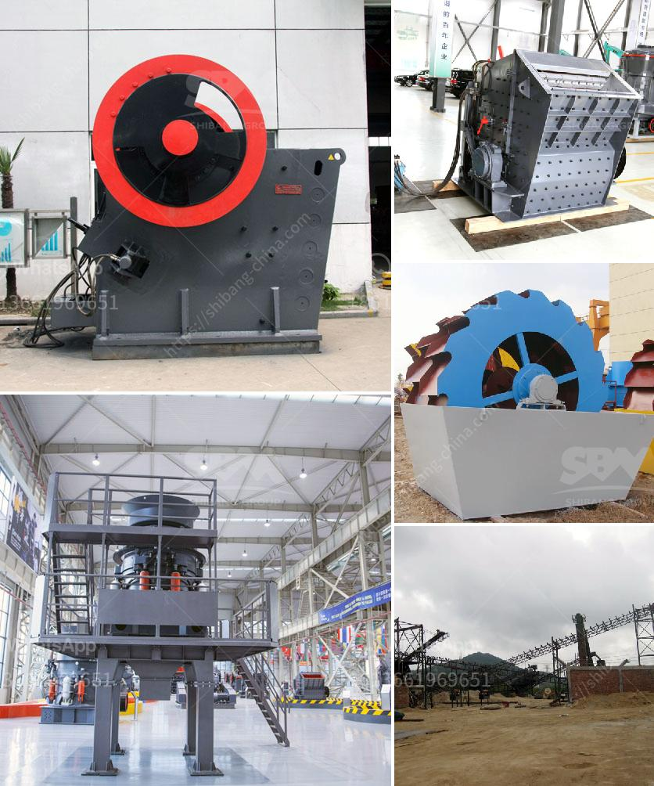

<h3>canada gold mining equipment</h3>
Canada is a country known for its rich natural resources, and gold mining is no exception. With a long history of gold mining and a well-established industry, Canada has become one of the leading countries in the global gold mining sector. To support this industry, various types of gold mining equipment are used, ensuring the efficient extraction and processing of gold ore.

One of the essential pieces of equipment used in gold mining is crushers. Crushers break down large rocks into smaller, more manageable sizes, allowing for easier processing and extraction of gold. They come in various types, such as jaw crushers, cone crushers, and impact crushers, each designed for different purposes in the gold mining process.

Another crucial tool in gold mining is the trommel. Usually, mounted on a wheeled or tracked chassis, the trommel consists of a rotating drum with various-sized holes. As gold-bearing sediments pass through the trommel, smaller materials, including gold particles, fall through the holes, while larger rocks and debris are conveyed out the other end. Trommels are efficient in separating gold from other materials, thereby facilitating the processing and recovery of gold.

For more specialized applications, gold mining equipment also includes concentrators. Concentrators are centrifugal devices that separate the heavy gold particles from lighter materials, such as sand and gravel. Using centrifugal force, concentrators can quickly extract and collect gold, making it easier to recover gold in large quantities.

Additionally, gold mining equipment includes gold pans, sluice boxes, and dredges. Gold pans are simple tools used to separate gold particles from sediment by swirling water and materials in the pan. Sluice boxes are long, narrow troughs equipped with riffles. As water flows through the sluice box, the riffles catch and trap gold particles. Dredges, on the other hand, are machines used to extract gold from riverbeds or streambeds by digging the sediment and processing it to separate the gold.

In conclusion, the gold mining industry in Canada heavily relies on various types of equipment to extract, process, and recover gold. Crushers, trommels, concentrators, and other tools play a crucial role in facilitating the efficiency and effectiveness of gold mining operations. With continued technological advancements and innovations, Canada's gold mining equipment will further enhance the industry's productivity and sustainability.
<h3>Contact us</h3><ul><li><strong>Whatsapp:&nbsp;<a href="https://wa.me/8613661969651">+8613661969651</a></strong></li><li><a href="https://swt.shibang-china.com/?git&amp;zhl&amp;canada gold mining equipment"><strong>Online Service(chat now)</strong></a></li></ul><h3>Related</h3><ul><li><a href='rock screening plants.md'>rock screening plants</a></li><li><a href='manufacturer of 30 80 mesh grinding plant.md'>manufacturer of 30 80 mesh grinding plant</a></li><li><a href='complete stone processing equipment stone crusher 100tph.md'>complete stone processing equipment stone crusher 100tph</a></li><li><a href='rock crusher distributors in denver colorado.md'>rock crusher distributors in denver colorado</a></li><li><a href='crushing complete crushing plant 80 120tph hard rock.md'>crushing complete crushing plant 80 120tph hard rock</a></li></ul>