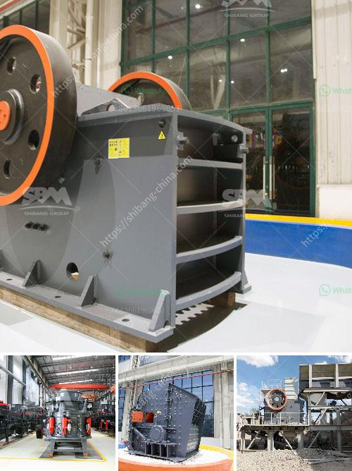

<h3>canber de broage ciment</h3>
In recent years, the construction industry has witnessed a revolutionary development in the form of Canber de Broage Cement. This specialized cement has created a buzz among architects, engineers, and contractors due to its impressive qualities and potential to reshape the construction landscape. In this article, we will explore Canber de Broage Cement, its composition, key characteristics, and the significant impact it is expected to have on the industry.

Canber de Broage Cement is a type of hydraulic cement that consists of a blend of Portland cement, limestone, and other additives. The exact composition may vary slightly depending on the manufacturer. The production process involves mixing the ingredients in precise ratios and then grinding them to form a fine powder.

1. Enhanced Durability: One of the standout features of Canber de Broage Cement is its unmatched durability. The inclusion of limestone and additives in its composition improves structural integrity, making it less prone to cracks, fractures, and water penetration. This increased durability significantly extends the lifespan of structures.

2. Eco-friendly: Canber de Broage Cement exhibits a lower carbon footprint compared to traditional cement types. The incorporation of supplementary cementitious materials during production reduces the amount of energy required, ultimately leading to lower greenhouse gas emissions.

3. High Flexural Strength: Flexural strength refers to a material's ability to bend without breaking. Canber de Broage Cement possesses excellent flexural strength due to its unique composition, making it ideal for constructing bridges, parking structures, and other infrastructure projects that require superior load-bearing capabilities.

4. Rapid Setting Time: Another advantage of Canber de Broage Cement is its quick setting time. This means that construction projects can progress at a much faster pace compared to using traditional cement, reducing overall project timelines.

5. Aesthetic Versatility: Canber de Broage Cement offers architects and designers greater freedom of expression in their projects. Its adaptability and compatibility with various finishes, textures, and colors make it a sought-after choice for decorative and exposed concrete applications.

Canber de Broage Cement has the potential to revolutionize the construction industry on several fronts:

1. Improved Sustainability: As governments and communities increasingly demand sustainable construction practices, Canber de Broage Cement's eco-friendly attributes position it as a significant player in reducing carbon footprints and contributing to a greener construction ecosystem.

2. Enhanced Longevity and Maintenance: The increased durability of Canber de Broage Cement not only ensures a longer lifespan for structures but also reduces the frequency and cost of maintenance or repairs, enhancing financial efficiency and operational sustainability.

3. Streamlined Construction Timelines: With its rapid setting time, Canber de Broage Cement enables faster completion of projects, saving time and costs for all stakeholders involved.

4. Aesthetic Freedom: Architects and designers will benefit from the aesthetic versatility of Canber de Broage Cement, which allows them to create stunning and visually appealing structures while maintaining structural integrity.

The introduction of Canber de Broage Cement sets a new benchmark in the construction industry. Its durability, eco-friendliness, and unique characteristics make it a gamechanger in sustainable infrastructure development. As the demand for sustainable and resilient construction practices grows, Canber de Broage Cement is poised to play a vital role in shaping the future of the industry. With its ability to improve longevity, streamline project timelines, and offer aesthetic versatility, this specialized cement proves that innovation is the key to a brighter and more sustainable construction landscape.
<h3>Contact us</h3><ul><li><strong>Whatsapp:&nbsp;<a href="https://wa.me/8613661969651">+8613661969651</a></strong></li><li><a href="https://swt.shibang-china.com/?git&amp;zhl&amp;canber de broage ciment"><strong>Online Service(chat now)</strong></a></li></ul><h3>Related</h3><ul><li><a href='technology of conveyor belts.md'>technology of conveyor belts</a></li><li><a href='pine cone coal manufacturing machinery.md'>pine cone coal manufacturing machinery</a></li><li><a href='crushing and screening machinery.md'>crushing and screening machinery</a></li><li><a href='production quarzt sand machine.md'>production quarzt sand machine</a></li><li><a href='lime stone grinder mill.md'>lime stone grinder mill</a></li></ul>