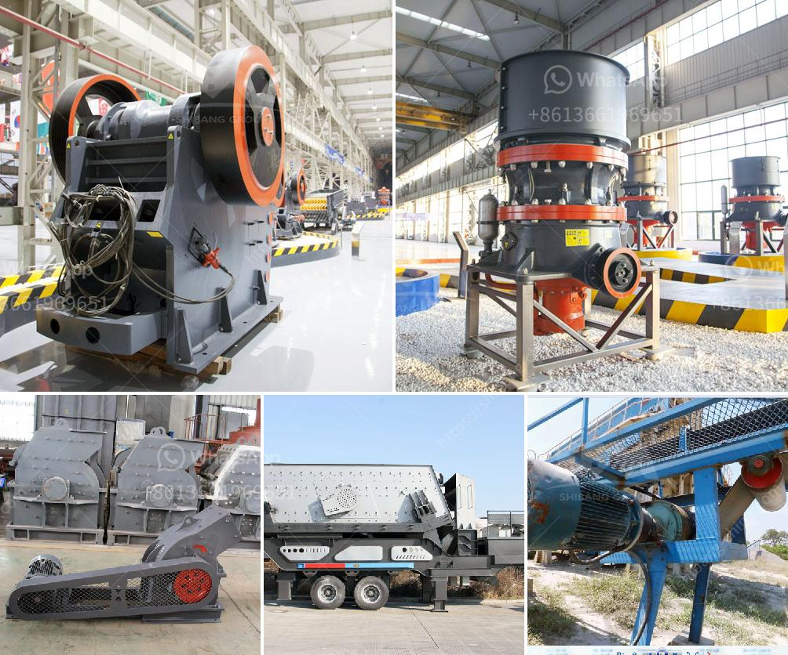

<h3>capacity 70 130tph impact crusher</h3>
When it comes to industrial materials processing, including mining, crushing, and recycling, efficiency is key. The capacity of an impact crusher plays a significant role in determining its effectiveness in these applications. With a capacity of 70-130tph, the impact crusher becomes a reliable and powerful tool for various operations, providing a high level of productivity and reducing downtime.

At its core, an impact crusher is designed to reduce large rocks into smaller rocks, gravel, or rock dust. This process is achieved by using heavy-duty rotor systems with high rotational speeds that strike the material being fed into the machine, causing it to break apart. The resulting crushed material can then be used for various purposes in the construction and mining industries.

One of the key advantages of an impact crusher with a capacity of 70-130tph is its versatility. This range allows the machine to handle a wide variety of materials, including limestone, concrete, asphalt, and more. Whether it's a primary, secondary, or tertiary application, the impact crusher can adapt to different requirements, making it a versatile and cost-effective choice.

Another significant feature of this impact crusher is its superior crushing efficiency. The machine utilizes advanced crushing principles, such as inter-particle collision and rock-on-rock crushing, which ensure that a higher percentage of the input material is reduced in size. This results in a higher quality and more consistent end product with fewer fines. The efficiency of the crusher also reduces the energy consumption per ton of production, reducing overall operating costs.

Additionally, the impact crusher with a capacity of 70-130tph is designed with user-friendliness in mind. The machine incorporates features that simplify maintenance and minimize downtime, ensuring maximum operational availability. An easy-to-access inspection door allows quick and safe access to the rotor, hammers, and wear parts for inspection and replacement. Furthermore, the hydraulic adjustment system enables effortless control of the product size, allowing operators to adapt quickly to changing demands.

Safety is another crucial consideration in any industrial setting. The impact crusher is equipped with several safety features to protect both the operator and the machine. A lockable engine compartment and emergency stop buttons ensure quick shutdown in case of emergencies. Additionally, the crusher's robust construction, including reinforced steel frame and impact-resistant components, provides durability and longevity even under challenging operating conditions.

In conclusion, the capacity 70-130tph impact crusher is a powerful and efficient tool for various materials processing applications. Its versatility allows it to handle a wide range of materials, while its superior crushing efficiency ensures a high-quality end product. With user-friendly features and enhanced safety measures, this impact crusher offers a reliable and productive solution for industrial operations. Investing in this machine can significantly increase productivity, reduce downtime, and ultimately improve the overall efficiency of materials processing.
<h3>Contact us</h3><ul><li><strong>Whatsapp:&nbsp;<a href="https://wa.me/8613661969651">+8613661969651</a></strong></li><li><a href="https://swt.shibang-china.com/?git&amp;zhl&amp;capacity 70 130tph impact crusher"><strong>Online Service(chat now)</strong></a></li></ul><h3>Related</h3><ul><li><a href='used portable crushing plant for sale.md'>used portable crushing plant for sale</a></li><li><a href='coal manufacturing machine price in malaysia.md'>coal manufacturing machine price in malaysia</a></li><li><a href='ball mill in ceramic industry.md'>ball mill in ceramic industry</a></li><li><a href='bauxite mining process flow chart germany.md'>bauxite mining process flow chart germany</a></li><li><a href='the vertical mill ireland information.md'>the vertical mill ireland information</a></li></ul>