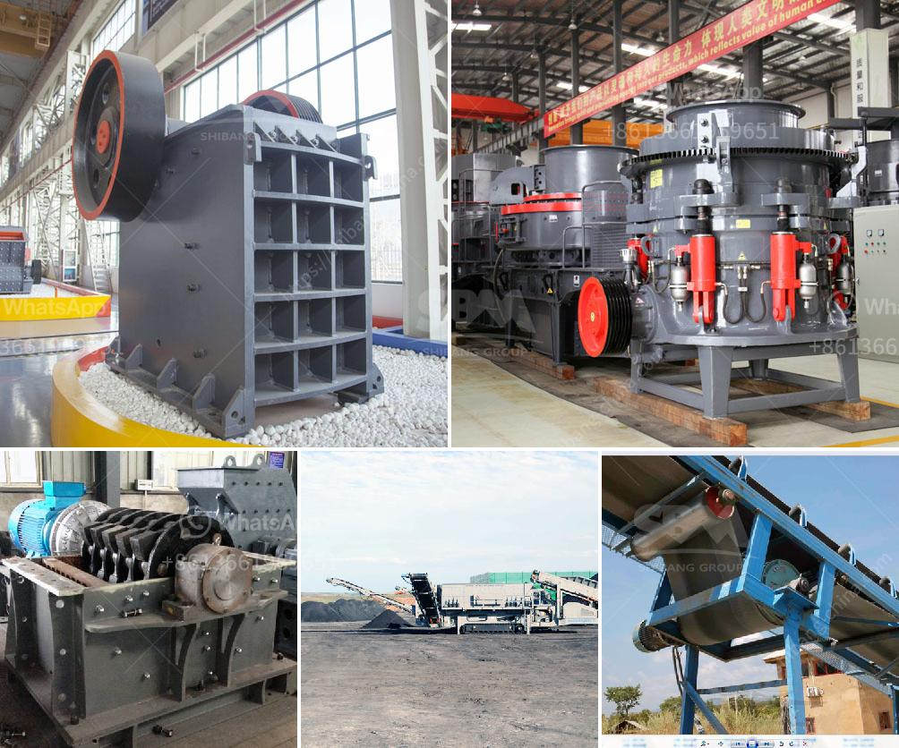

<h3>cara menentukan kapasitas belt conveyor</h3>
The capacity of a belt conveyor is an important factor to consider when designing and selecting a conveyor system. It determines the amount of material that can be transported and the speed at which it can be delivered. There are several factors that must be taken into account when determining the capacity of a belt conveyor.

Firstly, the width and speed of the belt are crucial factors in determining the conveyor's capacity. The width of the belt determines the amount of material that can be transported in a given time period. A wider belt has a higher capacity as it can carry a larger volume of material. Additionally, the speed at which the belt moves also affects the conveyor's capacity. A faster moving belt can transport material more quickly, resulting in a higher capacity.

The length and incline of the conveyor also play a role in determining its capacity. A longer conveyor can transport more material as it has a greater surface area. However, a longer conveyor may also require additional power to operate. In terms of incline, a conveyor that operates on an incline will have a lower capacity compared to a horizontal conveyor. This is because the weight of the material being transported adds to the overall load on the conveyor, making it more difficult to move.

The type and size of the material being transported are important considerations when determining the conveyor's capacity. Different materials have different densities and flow characteristics, which can affect the conveyor's efficiency. For example, lightweight materials such as grains or powders may have a higher capacity compared to heavier materials like rocks or coal.

Furthermore, the load on the conveyor must be considered when determining its capacity. The load refers to the weight of the material being transported. If the load is consistently at the maximum capacity of the conveyor, it may lead to excessive wear and tear on the system, resulting in decreased efficiency and increased maintenance costs. It is important to ensure that the conveyor's capacity is greater than the maximum expected load to prevent any potential issues.

In conclusion, there are several factors that must be taken into account when determining the capacity of a belt conveyor. These include the width and speed of the belt, the length and incline of the conveyor, the type and size of the material being transported, and the load on the conveyor. By considering these factors, engineers and designers can ensure that they select a conveyor system with the appropriate capacity for their specific application.
<h3>Contact us</h3><ul><li><strong>Whatsapp:&nbsp;<a href="https://wa.me/8613661969651">+8613661969651</a></strong></li><li><a href="https://swt.shibang-china.com/?git&amp;zhl&amp;cara menentukan kapasitas belt conveyor"><strong>Online Service(chat now)</strong></a></li></ul><h3>Related</h3><ul><li><a href='crushing plant manufacturers in china.md'>crushing plant manufacturers in china</a></li><li><a href='harga jaw crusher.md'>harga jaw crusher</a></li><li><a href='used jaw crusher machine for sale nepal.md'>used jaw crusher machine for sale nepal</a></li><li><a href='used crusher for sale in south africa.md'>used crusher for sale in south africa</a></li><li><a href='feasibility study for gypsum processing plant pdf.md'>feasibility study for gypsum processing plant pdf</a></li></ul>