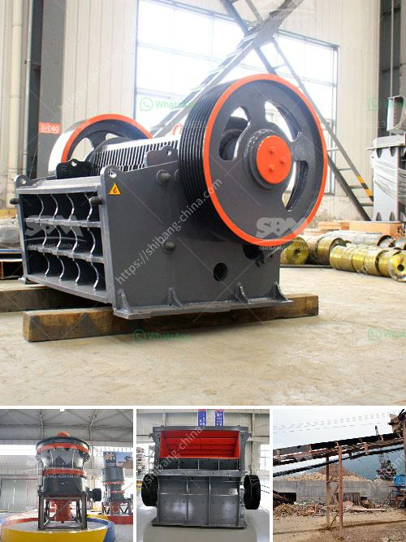

<h3>cara menghitung biaya pemasangan stone crusher plant</h3>
Stone crusher plant merupakan salah satu investasi yang membutuhkan biaya besar dalam pengelolaannya. Proses pemasangannya juga tidak bisa dilakukan secara sembarangan, namun perlu dihitung dengan matang agar proses pemasangan berjalan dengan lancar dan biaya yang dikeluarkan dapat terkontrol dengan baik. Untuk itu, berikut adalah cara menghitung biaya pemasangan stone crusher plant.

Langkah pertama yang harus dilakukan adalah menentukan spesifikasi stone crusher yang akan dipasang. Spesifikasi ini meliputi kapasitas stone crusher yang diinginkan, daya motor yang dibutuhkan, ukuran material yang akan dihancurkan, serta lokasi pemasangan stone crusher. Semakin tinggi kapasitas dan daya motor yang dibutuhkan, maka biaya pemasangan juga akan semakin besar.

Selanjutnya, hitung jumlah material yang dibutuhkan untuk pemasangan stone crusher plant. Material yang dibutuhkan antara lain batu split, pasir, semen, dan lain sebagainya. Pastikan jumlah material yang dihitung sesuai dengan spesifikasi yang telah ditentukan. Selain itu, perhatikan juga estimasi kebutuhan bahan bakar untuk mengoperasikan stone crusher plant.

Biaya pemasangan stone crusher plant juga akan dipengaruhi oleh jumlah tenaga kerja yang dibutuhkan. Hitung jumlah tenaga kerja yang akan terlibat dalam pemasangan, mulai dari operator stone crusher, tukang batu, tukang las, dan lain sebagainya. Pastikan jumlah tenaga kerja yang dihitung sesuai dengan tingkat kesulitan pemasangan.

Setelah mengetahui estimasi jumlah material dan tenaga kerja yang dibutuhkan, buatlah rencana anggaran untuk pemasangan stone crusher plant. Rencana anggaran ini meliputi biaya material, biaya tenaga kerja, serta biaya lainnya seperti biaya transportasi, biaya perizinan, dan biaya perawatan.

Setelah memiliki rencana anggaran, cari supplier yang terpercaya untuk memenuhi kebutuhan material stone crusher plant. Pilih supplier yang menawarkan harga terbaik dengan kualitas material yang baik pula. Selain itu, pastikan juga supplier dapat membantu dalam pengiriman material ke lokasi pemasangan.

Terakhir, hitung total biaya pemasangan stone crusher plant dengan menjumlahkan biaya material, biaya tenaga kerja, serta biaya lainnya yang telah dihitung sebelumnya. Bandingkan total biaya yang dihitung dengan anggaran yang telah disiapkan. Jika biaya melebihi anggaran, maka perlu dilakukan perubahan pada rencana anggaran atau mencari solusi alternatif untuk mengurangi biaya.

Dalam menghitung biaya pemasangan stone crusher plant, penting untuk memperhatikan setiap detail yang terkait. Pastikan semua estimasi jumlah material dan tenaga kerja telah dipertimbangkan secara akurat, serta pilih supplier yang terpercaya untuk memenuhi kebutuhan material. Dengan melakukan perhitungan dengan cermat dan teliti, diharapkan proses pemasangan stone crusher plant dapat berjalan dengan lancar dan biaya dapat terkontrol dengan baik.
<h3>Contact us</h3><ul><li><strong>Whatsapp:&nbsp;<a href="https://wa.me/8613661969651">+8613661969651</a></strong></li><li><a href="https://swt.shibang-china.com/?git&amp;zhl&amp;cara menghitung biaya pemasangan stone crusher plant"><strong>Online Service(chat now)</strong></a></li></ul><h3>Related</h3><ul><li><a href='cement plant cost estimation cement plant cost.md'>cement plant cost estimation cement plant cost</a></li><li><a href='crushing complete crushing plant 80 120tph hard rock.md'>crushing complete crushing plant 80 120tph hard rock</a></li><li><a href='ball mill ball mill factories.md'>ball mill ball mill factories</a></li><li><a href='alluvial chrome wash plant in the usa.md'>alluvial chrome wash plant in the usa</a></li><li><a href='impact crusher for sale in kenya.md'>impact crusher for sale in kenya</a></li></ul>