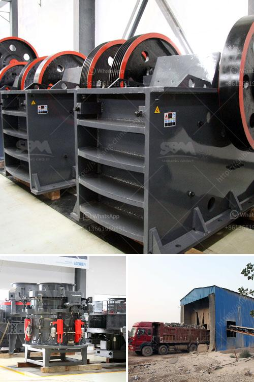

<h3>carbon black processing plant</h3>
Carbon black is a fine powder made from carbon-rich materials such as coal tar, natural gas, or petroleum residues. It is known for its excellent coloring and reinforcing properties and is widely used in various industries, including tires, rubber products, plastics, inks, and coatings. To meet the increasing demand for carbon black, companies are setting up processing plants equipped with advanced technology to produce high-quality carbon black efficiently.

A carbon black processing plant is a facility that receives raw materials and transforms them into carbon black powder through a series of complex processes. The plant typically consists of several units, including pyrolysis, grinding, classification, and packaging. Let's explore these units and the processing steps involved in manufacturing carbon black.

The first step in the process is pyrolysis, in which the raw materials are heated to high temperatures in an oxygen-free environment. This thermal decomposition breaks down the complex hydrocarbon molecules into simpler compounds, releasing volatile gases, liquids, and solid residue. The gases are collected and used as fuel or for energy generation, while the liquid residue is further processed to recover valuable by-products.

The solid residue from pyrolysis, called carbon black feedstock, is then transported to the grinding unit. Here, the feedstock is pulverized into smaller particles using specialized grinding mills. This grinding process is crucial for achieving the desired particle size and surface area of carbon black, which influence its properties and performance in various applications.

After grinding, the carbon black powder undergoes classification to separate it into different grades based on particle size. This step ensures consistency in the quality and performance of the final product. Advanced separation techniques, such as air classifiers, cyclones, and sieves, are used to achieve precise particle size distribution.

Once classified, the different grades of carbon black are packaged and stored for distribution. Packaging is done in specialized bags or containers to avoid contamination and ensure easy handling and transportation. The final product is then ready to be supplied to customers for use in their specific applications.

Efficiency and environmental sustainability are key considerations in modern carbon black processing plants. Advanced technologies, such as pyrolysis reactors with controlled temperature and residence time, help optimize the pyrolysis process and reduce energy consumption. Moreover, waste heat recovery systems are employed to utilize the excess heat generated during processing, further enhancing energy efficiency.

Additionally, modern carbon black processing plants incorporate emissions control systems to mitigate environmental impacts. These systems capture and treat the exhaust gases produced during pyrolysis, reducing pollutant emissions and ensuring compliance with environmental regulations.

In conclusion, carbon black processing plants play a crucial role in meeting the increasing demand for this versatile material. These facilities employ advanced technologies to efficiently transform raw materials into high-quality carbon black powder. Through the pyrolysis, grinding, classification, and packaging units, carbon black is manufactured with precise control over particle size, surface area, and quality. By focusing on efficiency and sustainability, these plants contribute to the growth of industries that rely on carbon black for its superior coloring and reinforcing properties.
<h3>Contact us</h3><ul><li><strong>Whatsapp:&nbsp;<a href="https://wa.me/8613661969651">+8613661969651</a></strong></li><li><a href="https://swt.shibang-china.com/?git&amp;zhl&amp;carbon black processing plant"><strong>Online Service(chat now)</strong></a></li></ul><h3>Related</h3><ul><li><a href='stone crusher in nairobi for sale.md'>stone crusher in nairobi for sale</a></li><li><a href='cost of jaw crusher.md'>cost of jaw crusher</a></li><li><a href='simple stone crushers kenya.md'>simple stone crushers kenya</a></li><li><a href='300tph ball mill manufacturer in philippines.md'>300tph ball mill manufacturer in philippines</a></li><li><a href='concrete crusher for rent qatar.md'>concrete crusher for rent qatar</a></li></ul>