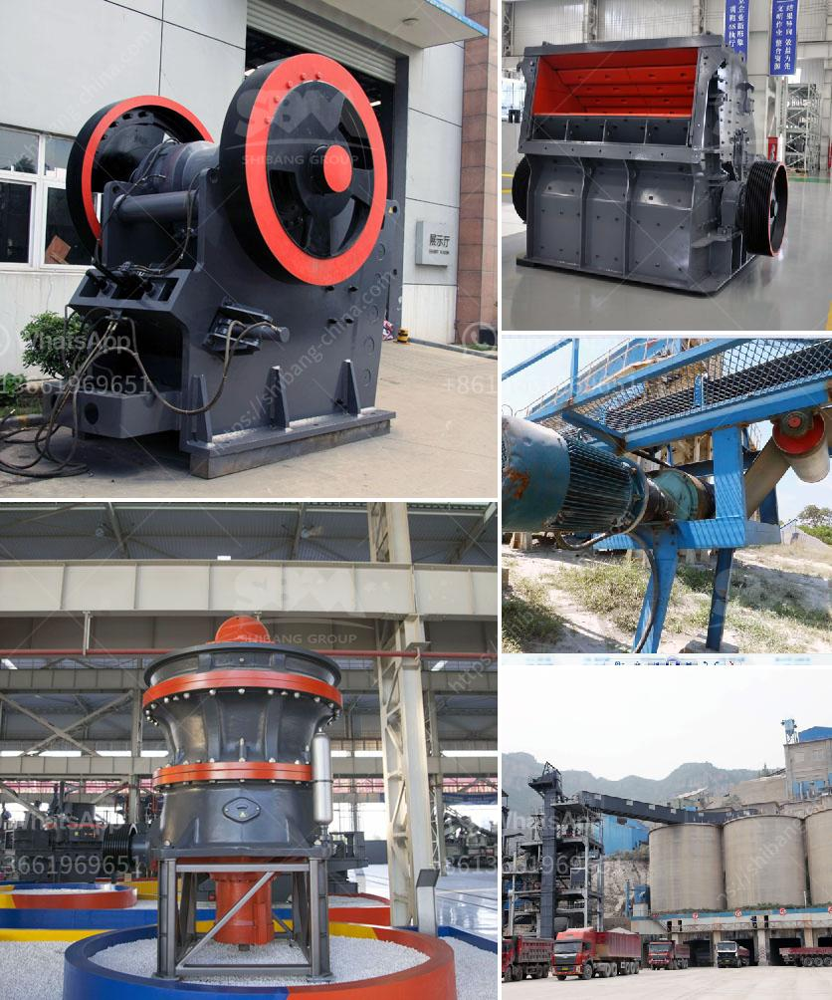

<h3>cement clinker grinding mill</h3>
Cement manufacturing is a complex process that involves various steps and stages to produce cement, a commonly used construction material. The process starts with the mining of raw materials, followed by their crushing, blending, and further grinding to create clinker, which is then ground into a fine powder in a cement clinker grinding mill.

Clinker grinding mills are vital pieces of equipment in cement plants. The purpose of these mills is to grind the clinker into a suitable fineness to produce cement. There are two types of clinker grinding mills: open circuit and closed circuit. Open circuit mills grind the clinker directly with the addition of a small amount of gypsum, while closed circuit mills use a separator to separate the fine particles from the coarse ones before grinding them.

One of the most efficient and reliable options for clinker grinding is a cement ball mill. Its applications range from grinding raw materials, clinker, and cementitious materials used in various building projects. With excellent energy efficiency and low maintenance requirements, cement ball mills are becoming the standard for grinding equipment in cement plants.

The working principle of a cement ball mill is quite simple. The ball mill consists of a cylindrical drum filled with grinding media, such as steel balls. As the drum rotates, the balls cascade and crush the clinker into a fine powder. The clinker is then mixed with gypsum to control the setting time of the cement and enhance its properties.

The use of a cement clinker grinding mill offers several advantages. Firstly, it helps in reducing energy consumption. Grinding clinker requires a substantial amount of energy, and a well-designed cement ball mill can effectively reduce energy consumption by 20-30% compared to a standard ball mill system.

Secondly, it improves cement quality and consistency. The grinding process in a cement ball mill ensures a uniform particle size distribution, which is crucial for the strength development of the cement. This consistency leads to better control of cement setting time and overall improved cement quality.

Furthermore, a cement clinker grinding mill provides flexibility in terms of grinding various types of materials. It can grind not only clinker but also other additives, such as fly ash, slag, and limestone, which are commonly used in cement production. This versatility allows cement plants to utilize different materials and optimize their cement recipes accordingly.

Maintenance of a cement clinker grinding mill is relatively simple. Regular inspections, lubrication, and periodic repairs are required to ensure smooth operation and maximize the mill's lifespan. However, compared to other complex machinery in cement plants, the maintenance requirements for clinker grinding mills are relatively minimal.

In conclusion, a cement clinker grinding mill plays a vital role in the cement manufacturing process. With its ability to grind and blend various materials, it provides a reliable and energy-efficient solution for cement production. Cement ball mills are highly versatile and offer several advantages, including reduced energy consumption, improved cement quality, and flexibility in material selection. By investing in a reliable grinding mill, cement plants can enhance their efficiency and sustainability in the competitive construction industry.
<h3>Contact us</h3><ul><li><strong>Whatsapp:&nbsp;<a href="https://wa.me/8613661969651">+8613661969651</a></strong></li><li><a href="https://swt.shibang-china.com/?git&amp;zhl&amp;cement clinker grinding mill"><strong>Online Service(chat now)</strong></a></li></ul><h3>Related</h3><ul><li><a href='cara menentukan kapasitas belt conveyor.md'>cara menentukan kapasitas belt conveyor</a></li><li><a href='grinding in vertical roller mill.md'>grinding in vertical roller mill</a></li><li><a href='mini robo sand unit price in india.md'>mini robo sand unit price in india</a></li><li><a href='cost cost of bauxite mining equipments.md'>cost cost of bauxite mining equipments</a></li><li><a href='gypsum crushing machine.md'>gypsum crushing machine</a></li></ul>