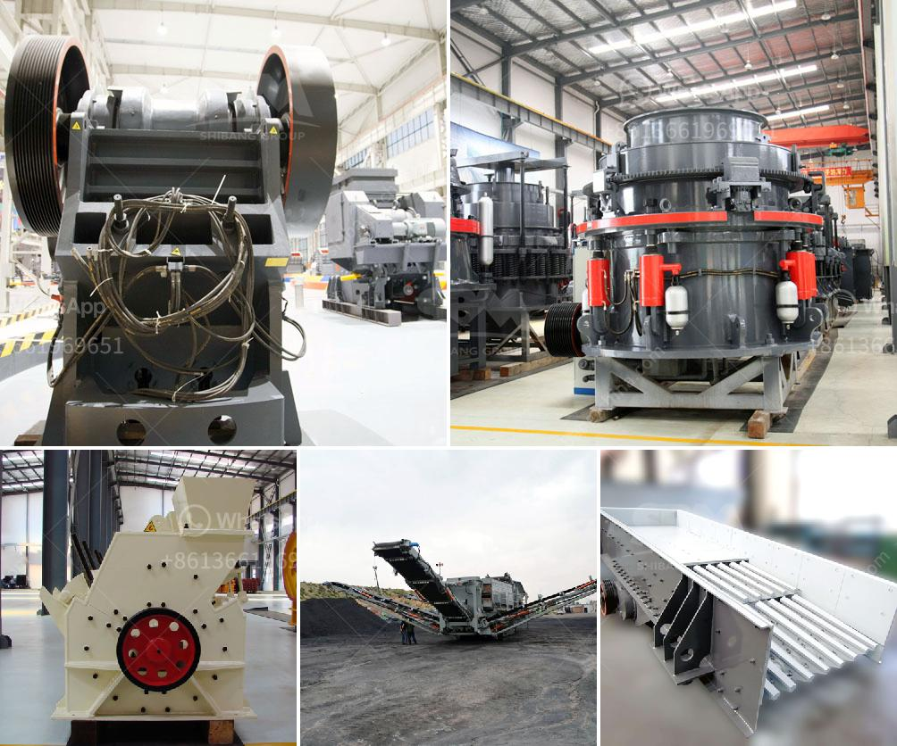

<h3>cement clinker manufacturing machine</h3>
Cement clinker manufacturing machine is a crucial equipment in the cement production line. The clinker produced by this machine is commonly used as the main ingredient in cement production, and serves as the binder for various materials, such as sand, iron ore, and limestone.

The cement clinker manufacturing machine has a few key components, including kiln, cooler, and preheating system. These components work together to drive the cement clinker manufacturing process and achieve the desired clinker quality.

The kiln is the heart of the cement clinker manufacturing machine. It is a large cylindrical structure that rotates slowly on its axis. Inside the kiln, raw materials are fed into one end and undergo various chemical reactions as they move towards the other end. The intense heat inside the kiln, reaching temperatures of up to 1450°C, causes chemical reactions that transform the raw materials into cement clinker.

The preheating system is another important component of the cement clinker manufacturing machine. It preheats the raw materials before they enter the kiln, which helps to reduce energy consumption and improve overall efficiency. In this system, the raw materials are heated by hot gases generated from the kiln exhaust, allowing for better utilization of the heat and more effective clinker production.

Once the clinker is formed inside the kiln, it needs to be cooled down rapidly to prevent overburning and ensure its quality. The cooler is responsible for this process. It uses air or water to cool the clinker, bringing its temperature down to around 100°C. The cooled clinker is then transported to storage areas for further processing.

The cement clinker manufacturing machine is designed to produce clinker in large quantities, typically in rotary kilns. These kilns can be up to 150 meters long and 6 meters in diameter, capable of producing thousands of tons of clinker per day. Their size and efficiency make them suitable for large-scale cement production plants.

In addition to the kiln, cooler, and preheating system, the cement clinker manufacturing machine may also include other auxiliary equipment, such as crushers, mills, and conveyors, to facilitate the handling and processing of raw materials, as well as the transportation of the clinker.

Overall, the cement clinker manufacturing machine plays a vital role in the cement production process. It enables the transformation of raw materials into clinker, which is the key component in cement production. The efficient and reliable operation of this machine is crucial for ensuring the quality and quantity of the cement produced.

As the global demand for cement continues to grow, the cement clinker manufacturing machine will become even more important in meeting this demand. The development of more advanced and energy-efficient machines will further enhance the sustainability and efficiency of the cement production process.
<h3>Contact us</h3><ul><li><strong>Whatsapp:&nbsp;<a href="https://wa.me/8613661969651">+8613661969651</a></strong></li><li><a href="https://swt.shibang-china.com/?git&amp;zhl&amp;cement clinker manufacturing machine"><strong>Online Service(chat now)</strong></a></li></ul><h3>Related</h3><ul><li><a href='ouedkniss station concassage.md'>ouedkniss station concassage</a></li><li><a href='new technology stone crusher in india.md'>new technology stone crusher in india</a></li><li><a href='mobile crusher in dubai.md'>mobile crusher in dubai</a></li><li><a href='mobile gold refinery for sale.md'>mobile gold refinery for sale</a></li><li><a href='famous stone crushing equipment supplier in china.md'>famous stone crushing equipment supplier in china</a></li></ul>