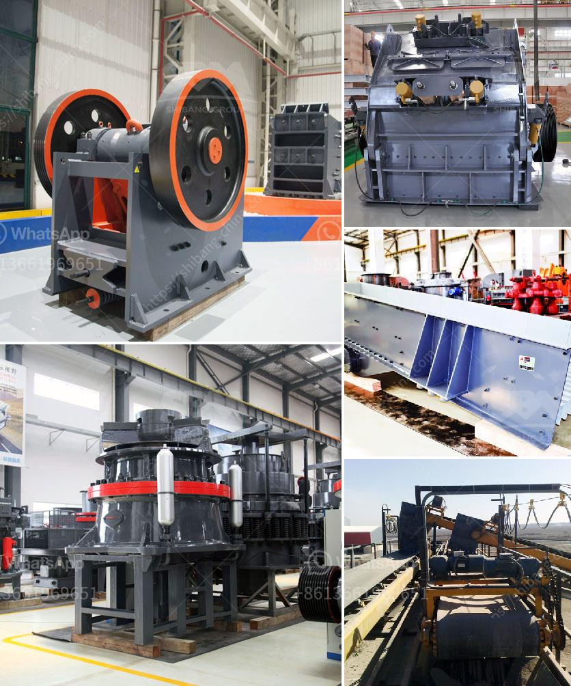

<h3>cement crusher plant macheniary</h3>
Infrastructure projects are on the rise in India due to the government's ambitious plans to develop the country's roads, ports, railways, and highways. Some of the mega projects that the government has undertaken include building 175,000 km of roads, 7,000 km of highways, and 150 airports by 2022. These projects require a considerable amount of cement, making cement crusher plant a necessity.

The main machinery in a cement plant comprises limestone crusher and stacker reclaimer, roller mills for grinding, coal crushers, packers, pollution control equipment, belt conveyers, etc. It is a fact that the cement industry is a major consumer of the energy using 1.5 percent of the world-fuel and about 2 percent of electricity produced globally.

In recent years, cement crushers such as limestone crushers, coal crushers, and more have been used widely in various cement plants due to their high crushing capacity. These machines are durable and reliable to withstand heavy-duty operations, and ensure a steady supply of required material for the cement production process.

Cement production relies heavily upon natural reserves. These reserves are limited and their extraction and shipment incur substantial costs. Efficient crushing reduces the environmental impact significantly and enhances the economic sustainability of the cement plant operations.

There are various types of crushers that can be used, depending on the application and the material used. Jaw crushers, cone crushers, gyratory crushers, and roll crushers all operate on the compression principle. Impact crushers utilize the impact principle, while hammermill crushers follow the high-speed impact principle.

The selection of crushers for cement plant should take into consideration the following factors, namely, raw material’s hardness (generally represented by the compressive strength), corrosiveness (usually described with free quartz content), and viscosity (water content, and clay, etc.).

Various types of crushers, including jaw crushers, cone crushers, hammer crushers, impact crushers, and more, are used in the cement industry to conduct the first stage of cement crushing. It is important for cement plants to choose the right crusher, to ensure optimal performance and maximum productivity.

To ensure an effective crushing operation, appropriate crushers need to be chosen based on their features and production characteristics. Although crushers perform similar tasks, the selection of appropriate crushers for cement plants is critical as these crushers play an important role in the cement production process.

Infrastructure projects have taken the center stage in India's development priorities. Cement crusher machinery plays a vital role in enhancing the production efficiency of cement production lines and cement plants. The crusher makes cement production more efficient and ensures a consistent supply of the required cementitious materials for the production of high-quality cement.
<h3>Contact us</h3><ul><li><strong>Whatsapp:&nbsp;<a href="https://wa.me/8613661969651">+8613661969651</a></strong></li><li><a href="https://swt.shibang-china.com/?git&amp;zhl&amp;cement crusher plant macheniary"><strong>Online Service(chat now)</strong></a></li></ul><h3>Related</h3><ul><li><a href='crushing of iron ore.md'>crushing of iron ore</a></li><li><a href='price list jaw crusher 150 x 200mm.md'>price list jaw crusher 150 x 200mm</a></li><li><a href='conveyor belting south africa.md'>conveyor belting south africa</a></li><li><a href='industrial mills in mexico.md'>industrial mills in mexico</a></li><li><a href='sale stone quarry crusher plant india.md'>sale stone quarry crusher plant india</a></li></ul>