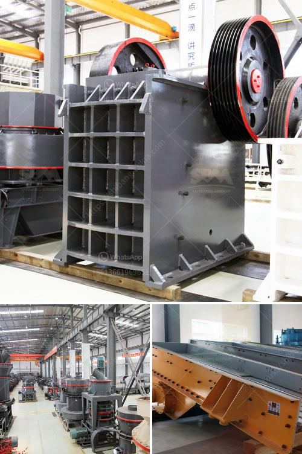

<h3>cement factories equipment in south africa</h3>
Cement factories are essential in the construction industry as they produce the key ingredient for concrete, which is used in various infrastructure projects. In South Africa, these factories are equipped with state-of-the-art equipment that ensures efficient production and meets the high demand for cement in the country.

One essential equipment found in cement factories is the kiln. Kilns are large rotary furnaces that generate extreme heat, reaching temperatures of up to 1500 degrees Celsius. They are used to produce clinker, the primary material required for cement production. Kilns in South Africa are designed with advanced technology to maximize heat transfer and minimize energy consumption, resulting in cost-effective operations.

Another critical piece of equipment in cement factories is the ball mill. Ball mills are horizontal rotating drums that grind the raw materials into fine powder. They consist of grinding media (steel balls) that crush and grind the materials, turning them into a homogenous mixture known as cement slurry. The ball mills in South African cement factories are designed to handle large loads and operate continuously, ensuring a steady supply of cement.

To ensure a seamless and efficient production process, cement factories in South Africa are equipped with sophisticated control systems. These systems monitor and regulate temperatures, pressures, and other parameters to maintain the desired quality and consistency of the cement. They also help in troubleshooting any issues that may arise during the manufacturing process, minimizing downtime and ensuring uninterrupted production.

Additionally, dust collectors and filters are installed in cement factories to control air pollution. Cement production involves the emission of dust and particulate matter, which can have negative impacts on air quality. Dust collectors effectively capture these particles, preventing them from being released into the atmosphere and reducing the environmental footprint of cement factories.

In conclusion, cement factories in South Africa are equipped with high-quality equipment that enables efficient and sustainable cement production. The use of modern technologies, such as advanced kilns, ball mills, control systems, dust collectors, and filters, ensures the smooth operation of these factories while complying with environmental regulations. These equipment play a critical role in meeting the growing demand for cement and supporting the development of infrastructure in South Africa.
<h3>Contact us</h3><ul><li><strong>Whatsapp:&nbsp;<a href="https://wa.me/8613661969651">+8613661969651</a></strong></li><li><a href="https://swt.shibang-china.com/?git&amp;zhl&amp;cement factories equipment in south africa"><strong>Online Service(chat now)</strong></a></li></ul><h3>Related</h3><ul><li><a href='crusher primary cone crusher.md'>crusher primary cone crusher</a></li><li><a href='gold mining company tanzania.md'>gold mining company tanzania</a></li><li><a href='mobile crushers south africa.md'>mobile crushers south africa</a></li><li><a href='mobile tracked crushers.md'>mobile tracked crushers</a></li><li><a href='conveyor belts in zambia.md'>conveyor belts in zambia</a></li></ul>