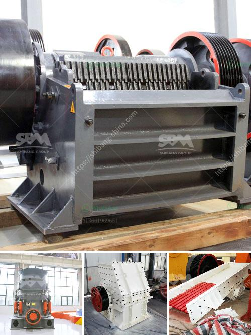

<h3>cement grinding mill pdf</h3>
Cement grinding is an essential step in the production process of cement, which is extensively used in construction projects worldwide. Cement grinding mills play a vital role in cement manufacturing and are responsible for the final product quality, sustainability, and efficiency. This article explores the significance of cement grinding mills and highlights the advantages of employing advanced technologies for optimizing the grinding process.

Cement grinding mills are designed to handle various types of cement from ordinary Portland cement to composite cements with additives. Grinding mills crush and grind the raw materials into a fine powder, enabling the cement to have the desired properties and strength. By adjusting the fineness of the grinding, the cement can better meet the requirements of specific construction applications.

The grinding process consumes a significant amount of energy in cement production. Therefore, it is crucial to optimize the grinding efficiency to minimize energy consumption and reduce carbon emissions. Advanced cement grinding mills are equipped with technological innovations to achieve enhanced grinding efficiency, such as high-pressure grinding rolls (HPGR), advanced process control systems, and vertical roller mills (VRM).

High-pressure grinding rolls (HPGR) utilize two counter-rotating rolls, which exert high pressure on the feed material. The compression forces generated efficiently break down the particles, resulting in a finer product. HPGR technology offers several benefits, including increased throughput, reduced specific energy consumption, and enhanced cement strength. Additionally, HPGR systems can handle a wider range of feed materials, reducing the need for costly pre-crushing stages.

Vertical roller mills (VRM) have become increasingly popular due to their ability to reduce energy consumption during grinding. VRMs employ grinding rollers to crush and grind the raw materials, enabling efficient grinding with a lower energy consumption compared to traditional ball mills. VRMs provide superior control over the grinding process, allowing operators to adjust the fineness according to specific requirements, resulting in optimized cement quality.

Advanced process control systems enable real-time monitoring and optimization of the grinding parameters. These systems collect data from various sensors installed within the mill, allowing operators to make informed decisions for improving efficiency and product quality. By continuously adjusting the mill operation, such as feed rate, mill speed, and separator speed, advanced process control systems ensure optimal grinding performance.

Cement grinding mills are crucial for achieving the desired strength and quality of cement. By adopting advanced technologies such as high-pressure grinding rolls, vertical roller mills, and advanced process control systems, cement manufacturers can optimize the grinding process, reduce energy consumption, and improve product quality. It is essential for the cement industry to embrace these advancements to meet the increasing demand for sustainable and efficient cement production.

In conclusion, the incorporation of advanced cement grinding mill technologies contributes to the overall sustainability and productivity of the cement industry, paving the way for optimal construction practices while minimizing its environmental impact.
<h3>Contact us</h3><ul><li><strong>Whatsapp:&nbsp;<a href="https://wa.me/8613661969651">+8613661969651</a></strong></li><li><a href="https://swt.shibang-china.com/?git&amp;zhl&amp;cement grinding mill pdf"><strong>Online Service(chat now)</strong></a></li></ul><h3>Related</h3><ul><li><a href='portable concrete crusher for rent qatar.md'>portable concrete crusher for rent qatar</a></li><li><a href='rock gypsum buyers in china.md'>rock gypsum buyers in china</a></li><li><a href='nigeria stone crusher to buy.md'>nigeria stone crusher to buy</a></li><li><a href='mobile stone crusher for concrete.md'>mobile stone crusher for concrete</a></li><li><a href='stone crusher saudi.md'>stone crusher saudi</a></li></ul>