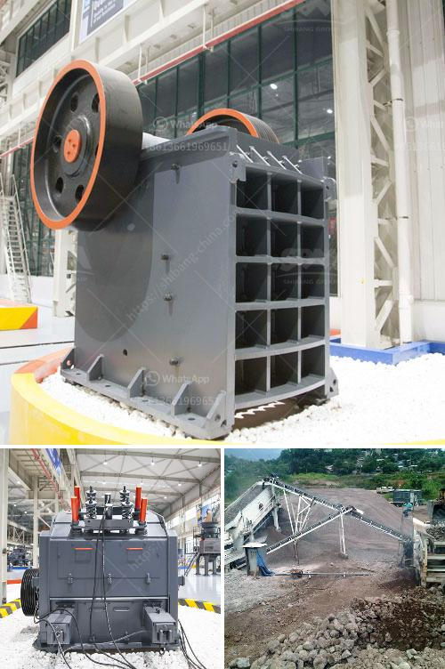

<h3>cement grinding mill price invest cost</h3>
Cement is one of the most widely used building materials, and its demand continues to increase with the growth of infrastructure development worldwide. The process of producing cement involves several stages, among which grinding the raw materials into a fine powder is essential for obtaining the desired quality and strength.

A cement grinding mill is the equipment used to grind the hard, nodular clinker from the cement kiln into the fine grey powder that is cement. Most cement is currently ground in ball mills and also vertical roller mills, which are more effective than ball mills. The grinding process consumes a large amount of energy, and the investment cost for cement grinding mill price is relatively high.

Grinding efficiency is important for the cement production process. With different techniques and various grinding mills, we can achieve different grinding results. For example, the cement grinding mill price for different grinding technologies varies greatly. The cement grinding process accounts for approximately 60-70% of the total energy consumption of a cement plant. Therefore, reducing the energy consumption in the grinding process is of great significance to save energy and reduce carbon emissions.

Investing in a cement grinding mill comes with a significant upfront cost. The price of a cement grinding mill depends on various factors, such as the capacity, material, electricity cost, and other auxiliary equipment. Generally, a small-scale cement grinding mill with a production capacity of less than 200 tons per day is affordable for most investors. However, larger-scale cement grinding mills with higher capacity can have a higher investment cost.

In addition to the initial investment cost, the operation and maintenance cost of a cement grinding mill should also be considered. The operation cost includes the cost of electricity, fuel, grinding media, and maintenance labor. Regular maintenance and inspection are essential to ensure the smooth operation and long lifespan of the grinding mill. The maintenance cost will vary depending on the size of the grinding mill and the quality of the equipment.

Nevertheless, investing in an efficient cement grinding mill can bring substantial benefits in the long run. The high grinding efficiency can increase the cement production capacity and reduce the energy consumption per unit of cement produced. Improved cement quality can effectively meet the market demand and enhance the competitiveness of cement manufacturers. Moreover, modern cement grinding mills are equipped with advanced technology and automation systems, which can improve the operation stability and reduce human intervention.

In conclusion, the cement grinding mill price invest cost is a crucial factor to consider when planning to invest in a cement grinding mill. Although the upfront investment cost might be high, the long-term benefits of increased production capacity, improved cement quality, and energy savings outweigh the initial cost. It is essential for investors to evaluate their specific needs and budget before making a decision. With the right investment, a cement grinding mill can contribute to a sustainable and profitable cement production process.
<h3>Contact us</h3><ul><li><strong>Whatsapp:&nbsp;<a href="https://wa.me/8613661969651">+8613661969651</a></strong></li><li><a href="https://swt.shibang-china.com/?git&amp;zhl&amp;cement grinding mill price invest cost"><strong>Online Service(chat now)</strong></a></li></ul><h3>Related</h3><ul><li><a href='ball mill in mining.md'>ball mill in mining</a></li><li><a href='cost of small scale cement plant.md'>cost of small scale cement plant</a></li><li><a href='granite stones crusher.md'>granite stones crusher</a></li><li><a href='dolomite rock crusher.md'>dolomite rock crusher</a></li><li><a href='high chrome impact crusher spare parts.md'>high chrome impact crusher spare parts</a></li></ul>