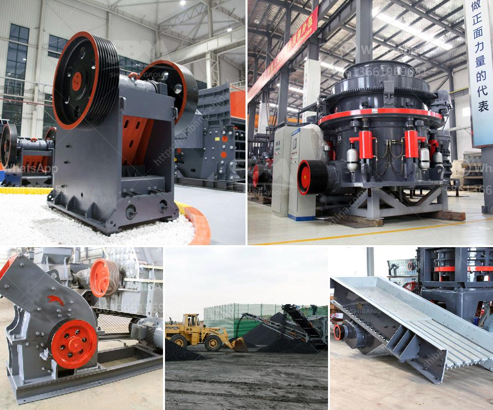

<h3>cement industries ball coal mill</h3>
The cement industry is one of the most prominent and vital sectors of the modern infrastructure. It plays a crucial role in the construction and development of the economy. The primary component of cement is limestone, which is naturally occurring and abundant in many parts of the world. However, before it is used in the production of cement, it needs to undergo several processes, one of which is grinding the raw materials into a fine powder.

To achieve the desired fineness for the raw materials, various types of grinding mills are employed in the cement industry. One such type is the ball coal mill. Ball coal mills are widely used in the cement industry and offer numerous advantages that make them a great choice for cement grinding.

The ball coal mill operates smoothly and has a high grinding efficiency. The grinding medium of the ball mill is filled with steel balls that grind the material as the mill rotates. The steel balls impact and grind the raw materials, leading to a highly efficient grinding process. Additionally, the ball coal mill employs a closed-circuit system, which helps maintain consistent and desired fineness in the cement product. The closed-circuit system includes a separator, which separates the fine particles from the coarse ones, ensuring that the final product meets the required specifications.

Another key advantage of the ball coal mill is its low energy consumption. The grinding process in the mill requires energy to be supplied to the mill motor. However, the ball coal mill is designed to minimize energy consumption by optimizing the grinding process and reducing unnecessary power usage. This is achieved through the precise control of the mill's operating parameters, such as the mill speed and ventilation rate. The optimization of these parameters helps minimize energy loss and increases the overall energy efficiency of the grinding process.

In addition to its energy efficiency, the ball coal mill is also known for its versatility. It can grind various types of materials, including limestone, coal, and other minerals, making it suitable for a wide range of cement production requirements. Furthermore, the ball mill can be used for both wet and dry grinding processes, further enhancing its versatility and applicability in the cement industry.

To ensure the smooth and efficient operation of the ball coal mill, regular maintenance and inspection are crucial. Proper lubrication of the mill's components, such as the bearings and gears, is essential to prevent any breakdowns. Additionally, monitoring the mill's performance through various indicators, such as power consumption and fineness of the product, can help identify any potential issues and optimize the grinding process.

In conclusion, the ball coal mill is an essential component of the cement industry and offers numerous advantages in terms of grinding efficiency, energy consumption, and versatility. Its smooth operation and ability to grind various materials make it a valuable tool in cement production. Nonetheless, proper maintenance and regular inspection are necessary to ensure its optimal performance and longevity.
<h3>Contact us</h3><ul><li><strong>Whatsapp:&nbsp;<a href="https://wa.me/8613661969651">+8613661969651</a></strong></li><li><a href="https://swt.shibang-china.com/?git&amp;zhl&amp;cement industries ball coal mill"><strong>Online Service(chat now)</strong></a></li></ul><h3>Related</h3><ul><li><a href='carbon black processing plant.md'>carbon black processing plant</a></li><li><a href='vibrating classifiing screen.md'>vibrating classifiing screen</a></li><li><a href='sand stone crusher.md'>sand stone crusher</a></li><li><a href='argentine hammer mills.md'>argentine hammer mills</a></li><li><a href='coal washing processing plant india manufacturer.md'>coal washing processing plant india manufacturer</a></li></ul>