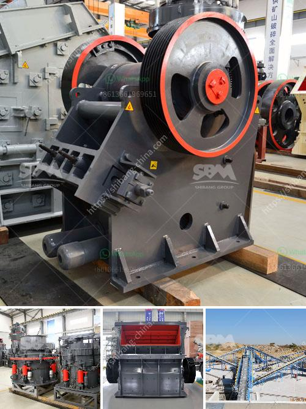

<h3>cement manufacturing processes</h3>
Cement manufacturing is a highly technical and complex process that involves various steps, each one requiring careful planning and meticulous execution. These steps include quarrying raw materials, grinding and blending materials, heating the mixture in a kiln, and finally, grinding the resulting clinker into fine powder. Let's delve into each of these processes in detail.

The first step in cement manufacturing is quarrying, where large deposits of limestone, clay, and other materials are extracted from the earth's crust. These raw materials are then transported to the crushing plant, where they are reduced in size and homogenized to ensure a consistent composition.

Next, the crushed materials are ground and blended to create a homogeneous mix. This process involves grinding the raw materials into a fine powder using crushers and ball mills. The finely ground mixture, known as raw meal, is then stored in silos until it is ready for further processing.

The third step is the preheating and calcination of the raw meal in a cement kiln. The temperature inside the kiln reaches around 1,500 degrees Celsius, causing a series of complex chemical reactions, known as clinkerization. During clinkerization, the raw meal transforms into clinker, which is essentially small nodules of cement-like material.

Once the clinker is formed, it is cooled and then ground into a fine powder. This final grinding step is performed by cement mills, which use steel balls or other grinding media to reduce the clinker into a fine powder. The resulting cement powder is then stored in silos until it is ready for packaging or further use.

Cement manufacturing is a resource-intensive process that requires large amounts of energy and raw materials. However, efforts are continually being made to improve the sustainability of cement production by developing more efficient kilns, using alternative fuels, and reducing emissions.

In conclusion, the cement manufacturing process involves several intricate steps, all of which contribute to the production of this essential building material. With advancements in technology and sustainable practices, the industry is constantly striving to reduce its environmental footprint and produce cement that meets the highest quality standards.
<h3>Contact us</h3><ul><li><strong>Whatsapp:&nbsp;<a href="https://wa.me/8613661969651">+8613661969651</a></strong></li><li><a href="https://swt.shibang-china.com/?git&amp;zhl&amp;cement manufacturing processes"><strong>Online Service(chat now)</strong></a></li></ul><h3>Related</h3><ul><li><a href='crushing plant for sale in.md'>crushing plant for sale in</a></li><li><a href='quick lime powder machine.md'>quick lime powder machine</a></li><li><a href='portable cone crusher specification.md'>portable cone crusher specification</a></li><li><a href='processing of delomite powder mill.md'>processing of delomite powder mill</a></li><li><a href='50tpd cement plant cost in india.md'>50tpd cement plant cost in india</a></li></ul>