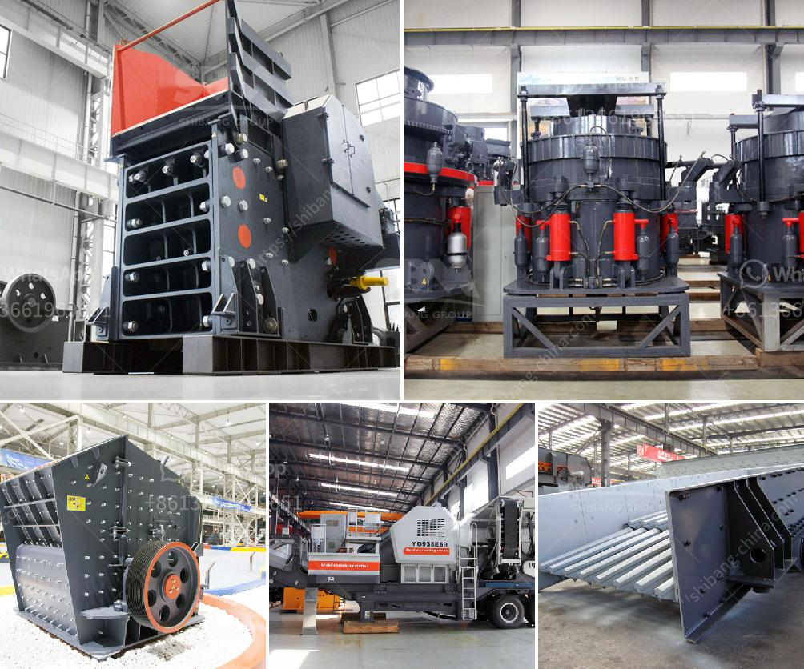

<h3>cement plant cost estimation cement plant cost</h3>
Running a cement plant is a complex and challenging task. Cement plants are highly capital-intensive projects, requiring substantial investments in machinery, equipment, and technology. Additionally, factors such as location, available resources, and the regulatory environment can greatly impact the cost of setting up a cement plant.

In this article, we will explore various factors involved in estimating the cost of a cement plant, helping investors and companies gain a deeper understanding of the key considerations to make before undertaking such a project.

Choosing the right location for a cement plant is crucial as it affects several aspects of the project, including land acquisition and transportation costs. The plant should be strategically located near raw material sources, as limestone, clay, and gypsum are essential ingredients for cement production. Furthermore, proximity to markets and transportation infrastructure should be considered to minimize logistical expenses.

Proper planning and design of the cement plant layout can optimize the utilization of space and resources. The design should ensure efficient flow of materials and minimize manual handling and transportation. It should also consider safety regulations, environmental sustainability, and effective waste management.

The choice of machinery and equipment will significantly impact the cost of setting up a cement plant. The cost estimation should include the purchase, installation, and commissioning of various machinery, such as crushers, mills, kilns, conveyors, and packaging equipment. It is crucial to select high-quality equipment that meets the required production capacity while maintaining operational efficiency.

Cement production is an energy-intensive process. Therefore, estimating the cost of energy supply is essential. Factors such as availability and cost of electricity, fuels for kilns (coal, oil, natural gas), and potential for utilizing waste heat or renewable energy sources should be considered.

Managing the plant workforce, including skilled labor for operating machinery and equipment, is significant. The cost estimation should include recruitment, training, salaries, benefits, and safety measures. Consideration should also be given to the availability of skilled labor in the plant's location and the potential requirement for specialized contractors.

Environmental regulations and compliance play a crucial role in cement plant operations. The cost estimation should consider the implementation of pollution control measures, such as dust collectors, waste management systems, and air emission control technologies. Compliance with local and national regulations is necessary to avoid penalties and legal issues.

Engaging engineering, procurement, and construction contractors can streamline the project's execution and reduce costs. The cost estimation should consider comprehensive EPC services from experienced contractors, ensuring timely completion, quality control, and adherence to safety standards.

It is important to note that the above factors are general guidelines, and the cost estimation for a cement plant can vary significantly depending on project-specific details, market conditions, and technological advancements.

In conclusion, estimating the cost of a cement plant is a complex endeavor that requires careful consideration of various interrelated factors. Engaging experts in project management, engineering, and finance is crucial to ensuring accurate cost estimation and successful project execution. A well-planned and cost-effective project can yield long-term benefits, including increased production capacity, market competitiveness, and profitability in the cement industry.
<h3>Contact us</h3><ul><li><strong>Whatsapp:&nbsp;<a href="https://wa.me/8613661969651">+8613661969651</a></strong></li><li><a href="https://swt.shibang-china.com/?git&amp;zhl&amp;cement plant cost estimation cement plant cost"><strong>Online Service(chat now)</strong></a></li></ul><h3>Related</h3><ul><li><a href='jaw crusher for sale kenya.md'>jaw crusher for sale kenya</a></li><li><a href='crushing of iron ore.md'>crushing of iron ore</a></li><li><a href='limestone powder manufacture machine.md'>limestone powder manufacture machine</a></li><li><a href='ball mills in coimbatore.md'>ball mills in coimbatore</a></li><li><a href='stone crusher supplier in orissa.md'>stone crusher supplier in orissa</a></li></ul>