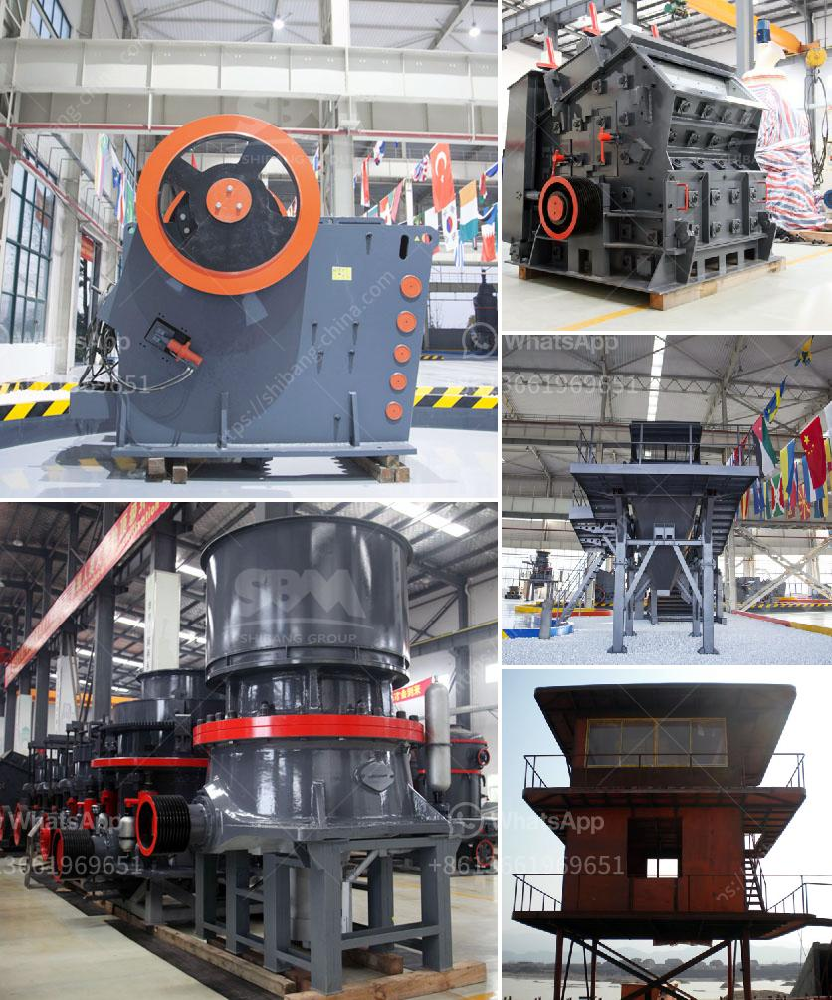

<h3>cement plant feasibility report</h3>
A cement plant feasibility report is a document that assesses the viability of establishing a cement manufacturing plant. It provides information on the market size, demand and supply dynamics, cost and profit margins, infrastructure requirements, capital investments, and other factors that are crucial for setting up a cement manufacturing plant.

The feasibility report begins with an overview of the cement industry, highlighting its significance in the construction sector and its contribution to the economy. It includes an analysis of the current market trends, growth potential, and key players in the industry to give a holistic view of the cement market.

One of the critical aspects assessed in a feasibility report is the demand and supply dynamics for cement. This involves studying the current and future construction activities, both residential and commercial, in the region. The report evaluates the market demand for cement by considering factors like population growth, urbanization rate, government policies, and infrastructure development plans.

The report also analyses the competitive landscape and market share of major cement manufacturers in the region. This helps potential plant investors to understand the level of competition, market segmentation, and identify any gaps or opportunities that can be leveraged.

Another crucial aspect of the feasibility report is the assessment of raw material availability and sourcing. Cement production requires large quantities of limestone, clay, iron ore, and gypsum, among other raw materials. The report evaluates the presence and accessibility of these materials, their quality, and the cost involved in their procurement. It also analyzes the transportation infrastructure and logistics required for the smooth supply of raw materials to the plant.

The report assesses the production process and technology options for cement manufacturing. It evaluates the different types of kilns, equipment, and machinery required for the plant, their cost, energy efficiency, and environmental impact. It also considers the availability of skilled labor and the associated training requirements.

Financial analysis forms a significant part of a cement plant feasibility report. It provides an overview of the capital investment required for setting up the plant, including the cost of land, infrastructure, machinery, and other miscellaneous expenses. The report also estimates the operating costs, such as raw material procurement, labor, energy consumption, and maintenance. It projects the revenue potential based on the expected production capacity, selling price, and market demand. The financial analysis includes cash flow projections, return on investment (ROI), and payback period to assess the profitability and financial feasibility of the project.

Lastly, the feasibility report outlines the regulatory and legal requirements for establishing a cement plant. It identifies the permits, licenses, and environmental clearances needed for construction and operation. It also highlights any compliance issues related to emission controls, waste management, and health and safety regulations.

In conclusion, a cement plant feasibility report is a comprehensive analysis that provides crucial information for potential investors looking to set up a cement manufacturing plant. It evaluates the market demand, raw material availability, production process, technology options, financial viability, and regulatory requirements. A well-prepared feasibility report helps investors make informed decisions and navigate the challenges and opportunities in the cement industry.
<h3>Contact us</h3><ul><li><strong>Whatsapp:&nbsp;<a href="https://wa.me/8613661969651">+8613661969651</a></strong></li><li><a href="https://swt.shibang-china.com/?git&amp;zhl&amp;cement plant feasibility report"><strong>Online Service(chat now)</strong></a></li></ul><h3>Related</h3><ul><li><a href='ball mill in mining.md'>ball mill in mining</a></li><li><a href='barite powder machine.md'>barite powder machine</a></li><li><a href='crusher conveyor belt.md'>crusher conveyor belt</a></li><li><a href='stone to sand crusher.md'>stone to sand crusher</a></li><li><a href='crushing plant in pangasinan.md'>crushing plant in pangasinan</a></li></ul>