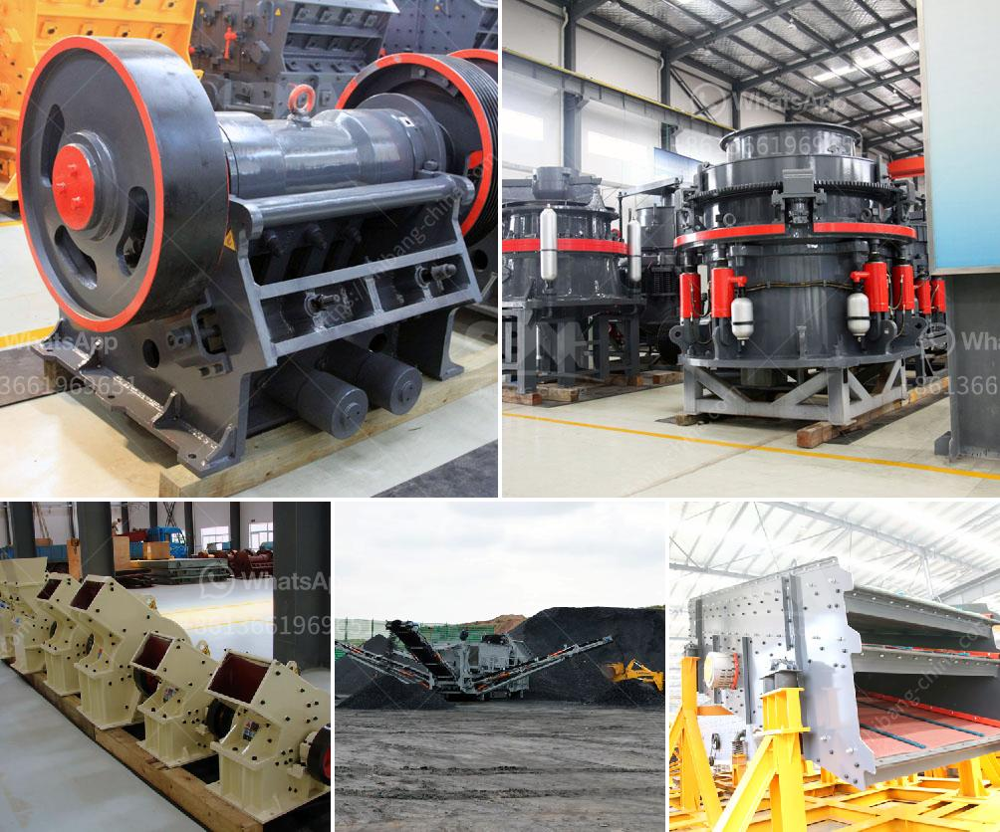

<h3>cement plant machine</h3>
Cement is a vital building material used in various construction projects around the world. To meet the growing demand for cement, cement plants rely on advanced machinery and equipment. These machines play a crucial role in the production process, ensuring efficiency and quality.

One of the key machines found in cement plants is the cement plant machine. This machine is responsible for grinding and blending the raw materials, such as limestone, clay, and iron ore, to form the desired composition known as cement clinker. The cement plant machine goes through several processes, including crushing, grinding, and homogenization, to produce a fine powder.

The cement plant machine is equipped with specialized equipment, such as crushers, mills, and separators, that work harmoniously to achieve the desired end product. Crushers are responsible for breaking down the raw materials into smaller pieces, while mills grind the materials to a fine powder. Separators then separate the powder into various components, ensuring the right composition for the cement.

In addition to grinding and blending, the cement plant machine also includes other equipment like kilns and coolers. Kilns are large rotating cylinders that heat the raw materials to extreme temperatures, transforming them into cement clinker. Coolers, on the other hand, cool down the clinker, allowing it to be handled and stored.

These cement plant machines are designed to be highly efficient and durable, considering the challenging conditions they operate in. The machines are made from robust materials and undergo regular maintenance to ensure their continuous operation.

The cement plant machine optimizes the production process, ensuring consistency and quality in the cement produced. By using advanced technology and precise engineering, these machines are able to meet the demand for cement in an efficient and sustainable manner.

In conclusion, cement plant machines are essential in the production of cement. They perform crucial tasks such as grinding, blending, and homogenization to create the desired cement clinker. These machines are designed for efficiency and durability, helping cement plants meet the growing demand for cement worldwide.
<h3>Contact us</h3><ul><li><strong>Whatsapp:&nbsp;<a href="https://wa.me/8613661969651">+8613661969651</a></strong></li><li><a href="https://swt.shibang-china.com/?git&amp;zhl&amp;cement plant machine"><strong>Online Service(chat now)</strong></a></li></ul><h3>Related</h3><ul><li><a href='ball mill in mining.md'>ball mill in mining</a></li><li><a href='manufacturing and processing plant.md'>manufacturing and processing plant</a></li><li><a href='crusher machine plant in kenya price.md'>crusher machine plant in kenya price</a></li><li><a href='ball mills in limpets.md'>ball mills in limpets</a></li><li><a href='coal pulverizing mills.md'>coal pulverizing mills</a></li></ul>