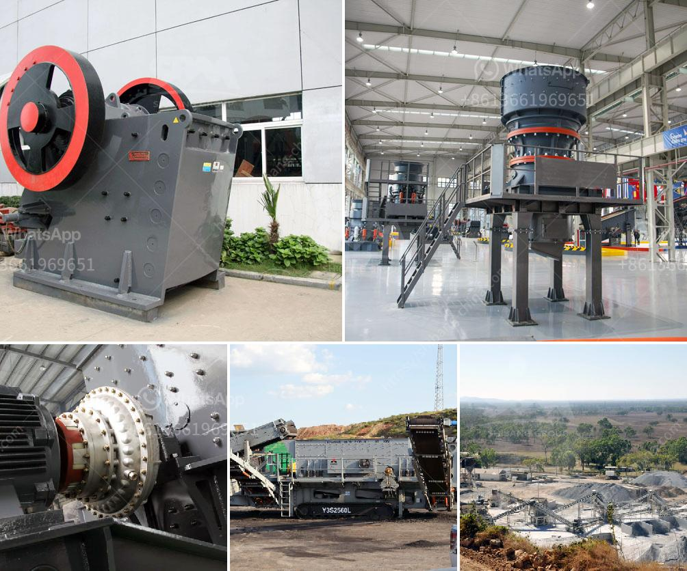

<h3>cement plant machinery manufacturers</h3>
Cement is one of the most widely used building materials in the world, and the demand for it continues to grow as urbanization and infrastructure development expands. Cement plants play a crucial role in meeting this demand by producing cement in large quantities. To achieve this, cement plant owners rely on high-quality machinery from reputable manufacturers.

Cement plant machinery manufacturers are companies that design, engineer, and produce machinery used in cement manufacturing. These machinery include kilns, clinker grinding units, vertical shaft kilns, rotary kilns, and crushers. Each of these machines plays a significant role in the cement production process.

One of the leading cement plant machinery manufacturers is located in India. The company has been operating for over two decades and has gained a strong reputation for its high-quality machinery. They have successfully supplied cement plants to various parts of the world, including Africa, Asia, Europe, and the Middle East.

When it comes to choosing the right cement plant machinery manufacturer, there are several factors that plant owners must consider. First and foremost is the quality of the machinery. Investing in reliable and durable machinery is essential for uninterrupted production and to minimize downtime. Reputable manufacturers ensure that their machines are made from high-quality materials and are built to withstand the demanding conditions of a cement plant.

Another crucial consideration is the manufacturer's expertise and experience in the cement industry. Manufacturers who have been in the business for a long time understand the specific requirements and challenges faced by cement plants. They can provide valuable insights and solutions to optimize the plant's production processes.

In addition to quality and expertise, the cost of machinery is also an important factor to consider. Cement plant owners need to strike a balance between quality and cost-effectiveness. Reputable manufacturers offer competitive prices without compromising on the quality of their machinery. Some manufacturers also provide after-sales support and maintenance services, which further contribute to the overall cost-effectiveness of their products.

Technology is another area where cement plant machinery manufacturers continuously strive to innovate. Advancements in technology have led to the development of more efficient and environmentally friendly machines. For instance, some manufacturers have introduced vertical shaft kilns that have a smaller environmental footprint compared to conventional rotary kilns. These technological advancements not only improve plant productivity but also contribute to sustainable development.

In conclusion, cement plant machinery manufacturers play a vital role in the cement manufacturing industry. Their expertise and high-quality machinery ensure uninterrupted and efficient cement production. When choosing a manufacturer, plant owners must consider the quality of the machinery, the manufacturer's expertise in the industry, the cost-effectiveness of the products, and the technological advancements offered. By partnering with a reputable manufacturer, cement plant owners can enhance their production capabilities and contribute to the growth of the construction industry.
<h3>Contact us</h3><ul><li><strong>Whatsapp:&nbsp;<a href="https://wa.me/8613661969651">+8613661969651</a></strong></li><li><a href="https://swt.shibang-china.com/?git&amp;zhl&amp;cement plant machinery manufacturers"><strong>Online Service(chat now)</strong></a></li></ul><h3>Related</h3><ul><li><a href='mining equipment for sale in japan.md'>mining equipment for sale in japan</a></li><li><a href='pictures of coal mining equipment.md'>pictures of coal mining equipment</a></li><li><a href='fine grinding mill for sale.md'>fine grinding mill for sale</a></li><li><a href='cost of grinding mill.md'>cost of grinding mill</a></li><li><a href='cone crusher msp300.md'>cone crusher msp300</a></li></ul>