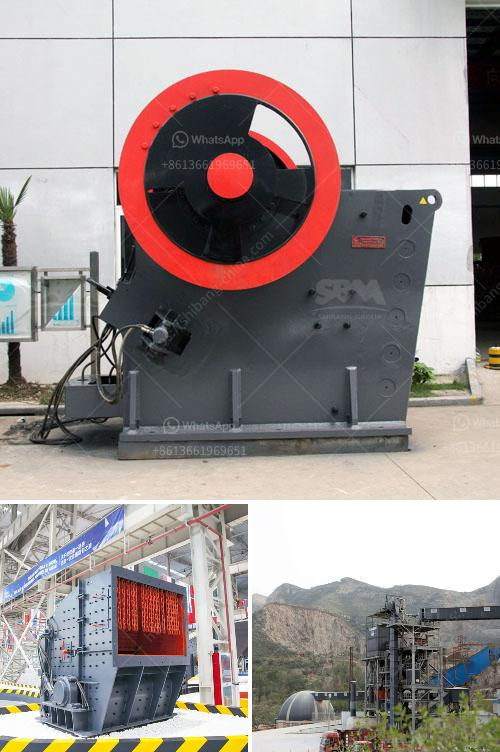

<h3>cement plants in west bengal list</h3>
West Bengal, a state located in the eastern part of India, is not only known for its rich cultural heritage but also its immense industrial potential. Over the years, the state has seen significant infrastructural advancement, with the construction industry playing a vital role. Cement is a crucial component in the construction sector, and West Bengal boasts a robust network of cement plants that contribute to the development and modernization of the state.

Here, we present a comprehensive list of prominent cement plants in West Bengal, showcasing their contributions to the region's growth and development.

UltraTech Cement Ltd. is a subsidiary of the multinational conglomerate Aditya Birla Group. With its plant situated in Durgapur, West Bengal, UltraTech Cement manufactures and markets high-quality cement variants suitable for various construction applications. The company is committed to sustainability and employs advanced technologies to minimize their environmental impact.

Ambuja Cement, a part of LafargeHolcim Group, operates a cement plant in Farakka, near the West Bengal-Bangladesh border. Ambuja Cement holds a strong presence in the eastern region of India, supplying quality cement to significant infrastructural projects across West Bengal.

Dalmia Cement, one of the leading players in the Indian cement industry, operates a plant in Salboni, West Bengal. The company is renowned for its commitment to sustainable practices and has received numerous accolades for its contributions to environmental conservation. Dalmia Cement aims to create a greener world through its innovative technologies and initiatives.

Emami Cement, a subsidiary of the diversified Emami Group, runs a state-of-the-art integrated cement plant in Risda, West Bengal. Emami Cement has gained significant recognition for its quality products and customer-centric approach. The company boasts an extensive distribution network, ensuring its cement reaches even the remotest corners of West Bengal.

Shree Cement Ltd., a leading cement manufacturing company, operates plants in various parts of the country, including West Bengal. The company's grinding unit in Purulia, West Bengal, caters to the cement requirements of the eastern region. Shree Cement is known for its innovative manufacturing processes and commitment to sustainability.

JSW Cement Ltd., a subsidiary of JSW Group, operates cement plants across different states in India, including West Bengal. JSW Cement prioritizes efficiency and sustainability in its operations, employing advanced technologies and best practices. The company's Salboni plant in West Bengal contributes significantly to the state's cement production capacity.

These listed cement plants showcase West Bengal's potential to meet the growing demand for cement within the state and beyond. By manufacturing quality cement and employing sustainable practices, these companies contribute immensely to the region's economic growth and infrastructure development.

Furthermore, cement plants in West Bengal generate numerous employment opportunities for the local population, thereby fostering social inclusiveness and contributing to the state's overall prosperity.

It is worth noting that while cement plants play a vital role in development, they should also prioritize environmental protection. West Bengal's cement manufacturers are conscious of their environmental responsibilities and continuously invest in cleaner technologies, waste management systems, and reforestation initiatives to mitigate their carbon footprint.

As West Bengal embarks on a path of industrialization and infrastructure development, the presence of these cement plants ensures a steady supply of quality cement, while their sustainable practices pave the way for a greener and more sustainable future.
<h3>Contact us</h3><ul><li><strong>Whatsapp:&nbsp;<a href="https://wa.me/8613661969651">+8613661969651</a></strong></li><li><a href="https://swt.shibang-china.com/?git&amp;zhl&amp;cement plants in west bengal list"><strong>Online Service(chat now)</strong></a></li></ul><h3>Related</h3><ul><li><a href='list gold mining equipment and machines.md'>list gold mining equipment and machines</a></li><li><a href='iron slag crushing ball mill price.md'>iron slag crushing ball mill price</a></li><li><a href='crusher plant supplier.md'>crusher plant supplier</a></li><li><a href='stone crushing machine manufacturers in japan.md'>stone crushing machine manufacturers in japan</a></li><li><a href='stone quarries south africa.md'>stone quarries south africa</a></li></ul>