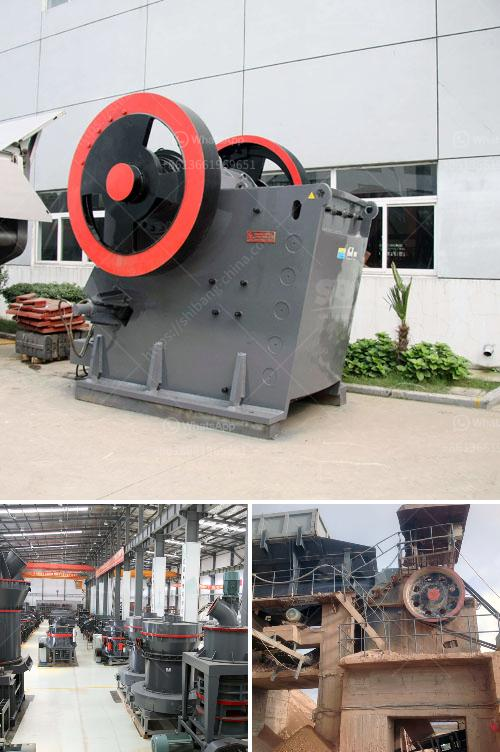

<h3>cement unit cost for 150 tons</h3>
The cost of cement units is a significant consideration for any construction project. Cement, being a fundamental material in the construction industry, plays a vital role in creating durable and sturdy structures. Thus, understanding the unit cost of cement is crucial for project planning and budgeting.

When purchasing cement in bulk, the price is often calculated per ton. For instance, if we consider a 150-ton requirement, the unit cost would be determined based on the market rate. This rate may vary depending on various factors such as location, demand, supply, and any prevailing market conditions.

On average, the unit cost of cement ranges between $80 to $150 per ton. However, it should be noted that this is an approximation, and the actual price may differ. It is essential to contact local suppliers or consult market reports to obtain an accurate estimation of the current unit cost of cement.

To ensure cost-effective procurement, it is advisable to obtain multiple quotes from different suppliers. Comparing prices can help identify the most competitive offer while maintaining the desired quality standards. Additionally, customers should consider the reliability and experience of the supplier, as well as their reputation for timely deliveries and product consistency.

Another factor to consider when estimating cement unit costs is transportation expenses. Ideally, selecting a supplier within close proximity to the project site can significantly reduce transportation costs. However, if the nearest supplier does not offer competitive pricing, it might be worth exploring options slightly farther away and assessing the additional transportation costs involved.

In conclusion, understanding the unit cost of cement is essential for project planning and budgeting. With an average cost ranging between $80 to $150 per ton, obtaining accurate information about the local market prices, comparing multiple suppliers, and taking transportation costs into account, will help ensure cost-efficient procurement of cement units for construction projects.
<h3>Contact us</h3><ul><li><strong>Whatsapp:&nbsp;<a href="https://wa.me/8613661969651">+8613661969651</a></strong></li><li><a href="https://swt.shibang-china.com/?git&amp;zhl&amp;cement unit cost for 150 tons"><strong>Online Service(chat now)</strong></a></li></ul><h3>Related</h3><ul><li><a href='crushing plant flow sheet.md'>crushing plant flow sheet</a></li><li><a href='fine powder mill.md'>fine powder mill</a></li><li><a href='plamnta mobile stone crusher.md'>plamnta mobile stone crusher</a></li><li><a href='conveyor belts in peru.md'>conveyor belts in peru</a></li><li><a href='gypsum manufacturer in ethiopia.md'>gypsum manufacturer in ethiopia</a></li></ul>