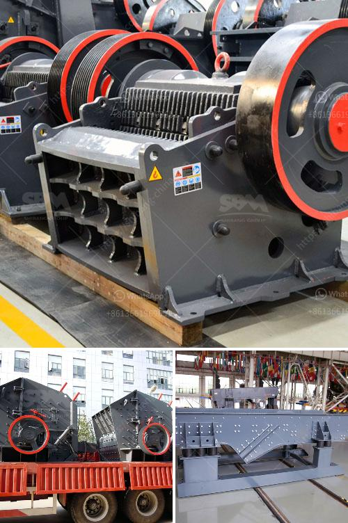

<h3>central shaft for stone crusher</h3>
A stone crusher is a machine designed to reduce large rocks into smaller rocks, gravel, or rock dust. Crushers may be used to reduce the size, or change the form, of waste materials so they can be more easily disposed of or recycled, or to reduce the size of a solid mix of raw materials, so that pieces of different composition can be differentiated. Crushing is the process of transferring a force amplified by mechanical advantage through a material made of molecules that bond together more strongly, and resist deformation more, than those in the material being crushed do.

One of the key components of a stone crusher is the central shaft or spindle. Typically, this shaft is supported at both ends, and is subjected to high loads and vibrations caused by the crushing action. Depending on the application, the central shaft can be either straight or curved. In some designs, the shaft is vertical, and the crushing chamber is positioned horizontally.

The central shaft of a stone crusher plays a crucial role in the functioning of the machine. It serves as a foundation and provides support to all the rotating parts and mechanical components. Additionally, it helps in transmitting the rotational motion generated by the electric motor to the crushing chamber, where the rocks are crushed.

To ensure the efficient and reliable operation of the stone crusher, the central shaft needs to be made from a sturdy and durable material that can withstand the high loads and vibrations. Common materials used for constructing the central shaft include high-grade steel or iron alloys, which offer excellent strength and durability.

Regular maintenance and inspection of the central shaft is crucial to identify any signs of wear or damage. This allows for timely repairs or replacements before any major breakdown or failure occurs, thus reducing downtime and increasing the lifespan of the stone crusher.

In conclusion, the central shaft of a stone crusher is a crucial component that requires regular maintenance to ensure its proper functioning. It serves as a foundation and provides support to all the rotating parts, facilitating the efficient crushing of rocks. The choice of material for the central shaft and regular inspections are vital to ensure the longevity and reliability of the stone crusher.
<h3>Contact us</h3><ul><li><strong>Whatsapp:&nbsp;<a href="https://wa.me/8613661969651">+8613661969651</a></strong></li><li><a href="https://swt.shibang-china.com/?git&amp;zhl&amp;central shaft for stone crusher"><strong>Online Service(chat now)</strong></a></li></ul><h3>Related</h3><ul><li><a href='gold corporation ball mill.md'>gold corporation ball mill</a></li><li><a href='lime stone crusher with capacity.md'>lime stone crusher with capacity</a></li><li><a href='pioneer ve rock crusher.md'>pioneer ve rock crusher</a></li><li><a href='mobile crusher debris.md'>mobile crusher debris</a></li><li><a href='stone crusher machine or rock breakers.md'>stone crusher machine or rock breakers</a></li></ul>