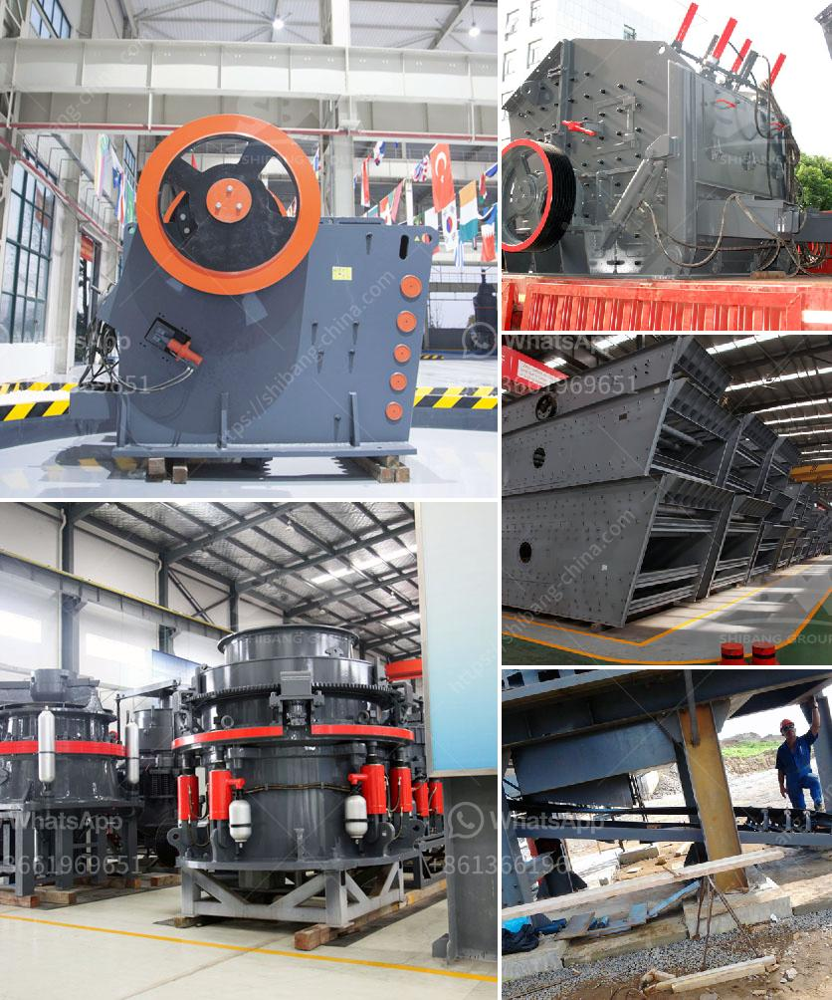

<h3>chaines talc granding company in malaysia</h3>
Talc is a naturally occurring mineral known for its softness and versatility. It serves various purposes across different industries, from cosmetics and personal care products to ceramics and paints. In Malaysia, one of the prominent players in the talc market is Chaines Talc Grinding Company. With its commitment to quality and customer satisfaction, the company has established itself as a leading talc supplier in the country.

Chaines Talc Grinding Company, headquartered in Kuala Lumpur, was founded in the early 2000s. Since its inception, the company has focused on delivering high-quality talc products to its customers. It has formed strategic partnerships with talc mines worldwide, ensuring a reliable supply of raw materials.

One of the key strengths of Chaines Talc Grinding Company is its state-of-the-art grinding facilities. Equipped with advanced machinery and technology, the company specializes in the production of finely ground talc powders. This gives them an edge in the market, as their products are known for their superior quality and consistency.

The company's manufacturing process begins with carefully selected talc ores. These ores undergo rigorous testing to ensure their purity and suitability for specific applications. Once the raw materials are approved, they are processed using the latest grinding techniques, resulting in finely ground talc powders.

Chaines Talc Grinding Company offers a wide range of talc products tailored to meet the diverse needs of its customers. Their product portfolio includes pharmaceutical-grade talc, cosmetic-grade talc, food-grade talc, and industrial-grade talc. Each grade is formulated to cater to the specific requirements of various industries, be it the smoothness and absorbency demanded by cosmetics or the high heat resistance needed for ceramics.

Quality is of utmost importance to Chaines Talc Grinding Company. The company adheres to stringent quality control measures at every stage of production, including thorough inspections and testing. This ensures that their talc products consistently meet international standards and exceed customer expectations.

Furthermore, the company prioritizes sustainability and environmentally friendly practices. They employ eco-friendly production processes and seek to minimize their carbon footprint. Chaines Talc Grinding Company strictly adheres to regulations governing waste management and pollution control, demonstrating their commitment to preserving and protecting the environment.

In addition to its dedication to quality and sustainability, Chaines Talc Grinding Company places great importance on customer satisfaction. They strive to understand their customers' requirements and deliver tailored solutions. Their team of experts provides technical support and guidance to clients, helping them select the most suitable talc products for their specific applications.

As a result of these factors, Chaines Talc Grinding Company has earned a strong reputation in the talc market in Malaysia. Their commitment to quality, advanced manufacturing facilities, diverse product range, and customer-centric approach have positioned them as a trusted and preferred supplier among various industries.

In conclusion, Chaines Talc Grinding Company is a leading talc supplier in Malaysia, known for its commitment to quality, sustainability, and customer satisfaction. With its state-of-the-art grinding facilities and diverse product portfolio, the company has successfully carved a niche in the market. As the demand for high-quality talc continues to grow, Chaines Talc Grinding Company is poised to maintain its position as a reliable talc supplier, catering to the evolving needs of industries in Malaysia and beyond.
<h3>Contact us</h3><ul><li><strong>Whatsapp:&nbsp;<a href="https://wa.me/8613661969651">+8613661969651</a></strong></li><li><a href="https://swt.shibang-china.com/?git&amp;zhl&amp;chaines talc granding company in malaysia"><strong>Online Service(chat now)</strong></a></li></ul><h3>Related</h3><ul><li><a href='used crushing plant for sale.md'>used crushing plant for sale</a></li><li><a href='rock crushers cost tons per hour.md'>rock crushers cost tons per hour</a></li><li><a href='aggregate crushing plant price.md'>aggregate crushing plant price</a></li><li><a href='station de concasassage theniet elhad.md'>station de concasassage theniet elhad</a></li><li><a href='3 roll mills machine manufacturers in europe.md'>3 roll mills machine manufacturers in europe</a></li></ul>