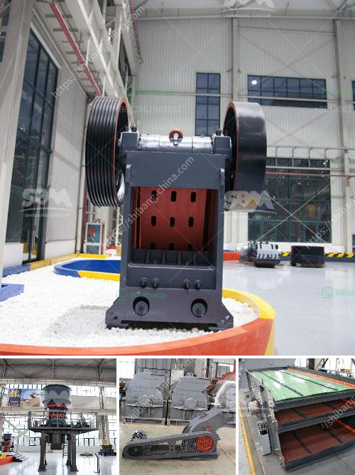

<h3>chalk manufacturing machinechalk mining machinery</h3>
Chalk has been a widely used material for writing and drawing for centuries. It is known for its smooth texture and easy erasability, making it a popular choice for teachers, artists, and children alike. However, have you ever wondered how chalk is manufactured? In this article, we will explore the process of chalk manufacturing and the machinery involved in chalk mining.

Chalk manufacturing begins with chalk mining, where large deposits of chalk are excavated from the earth. Chalk is primarily composed of calcium carbonate, a naturally occurring mineral found in limestone and marble. These deposits are then carefully extracted using heavy machinery and transported to a processing facility.

At the processing facility, the chalk is refined and purified to remove impurities and enhance its quality. To achieve this, several stages are involved. Initially, the chalk is crushed into small pieces using crushers or mills. This process breaks down the chalk into a fine powder, making it easier to handle and process further.

Once the chalk has been pulverized, it undergoes a process called wet suspension. In this stage, water is added to the chalk powder, creating a slurry-like mixture. This allows for better dispersion of the chalk particles and helps remove any remaining impurities. The mixture is then filtered to separate the liquid from the solid materials.

After filtration, the chalk slurry is placed in a drying kiln, where it is heated at high temperatures. This drives off the excess moisture, resulting in a dry chalk powder. This powder is then mixed with water, binders, and pigments, if desired, to create a paste-like substance. This paste is poured into molds, which are typically made of metal or plastic, in the shape of chalk sticks or other desired forms.

To facilitate the molding process, special chalk manufacturing machines are used. These machines are designed to create a uniform and consistent shape for each piece of chalk. They consist of automated systems that pour the chalk paste into molds and then compress it to remove any air bubbles or inconsistencies. The molds are then cooled, allowing the chalk to solidify and take shape within the desired dimensions.

Once the chalk has solidified, it is removed from the molds and undergoes a drying process to further harden the sticks. This is typically done in a drying chamber or in open-air environments, depending on the manufacturer's preference. After drying, the chalk sticks are inspected for quality control and packaged for distribution.

The chalk manufacturing process is a fascinating blend of science and engineering. From the initial extraction of chalk through mining machinery to the intricate molding and drying processes, each step is carefully executed to produce high-quality chalk products. The use of specialized chalk manufacturing machines enables manufacturers to streamline the production process, ensuring efficiency and consistency.

In conclusion, chalk manufacturing is a complex process that involves the careful extraction of chalk deposits, refining the material, and utilizing specialized machinery for molding and drying. The end result is a widely beloved writing and drawing tool that has captivated generations. So, next time you pick up a stick of chalk, remember the intricate process behind its creation.
<h3>Contact us</h3><ul><li><strong>Whatsapp:&nbsp;<a href="https://wa.me/8613661969651">+8613661969651</a></strong></li><li><a href="https://swt.shibang-china.com/?git&amp;zhl&amp;chalk manufacturing machinechalk mining machinery"><strong>Online Service(chat now)</strong></a></li></ul><h3>Related</h3><ul><li><a href='copper ore processing.md'>copper ore processing</a></li><li><a href='mines de cobalt de cuivre de la zambie.md'>mines de cobalt de cuivre de la zambie</a></li><li><a href='kaolin processing equipment manufacturers in germany.md'>kaolin processing equipment manufacturers in germany</a></li><li><a href='quarry crusher equipment suppliers miami.md'>quarry crusher equipment suppliers miami</a></li><li><a href='price list stone crusher german.md'>price list stone crusher german</a></li></ul>