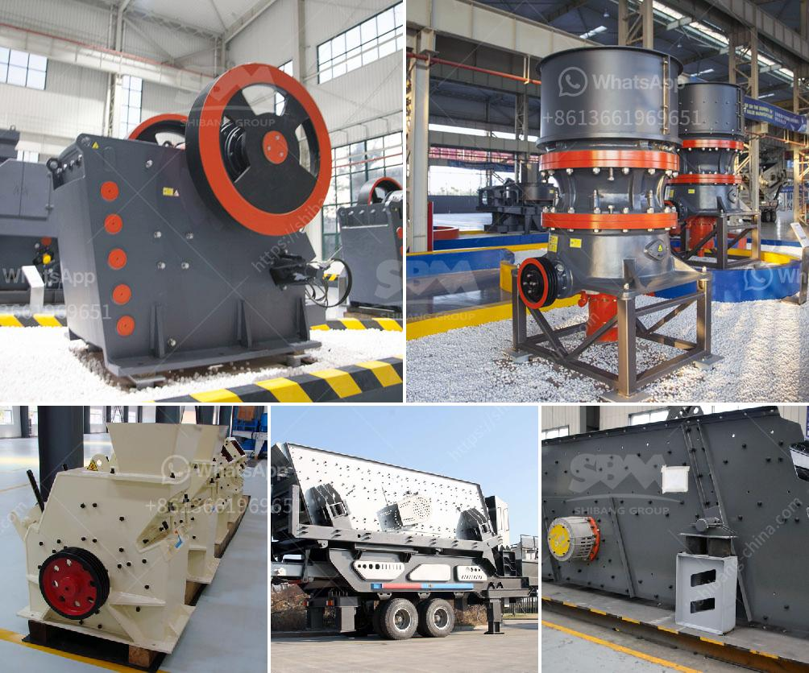

<h3>china hammer mill</h3>
Hammer mills are widely used in various industries, including mining, agriculture, and food processing. But what makes the hammer mill a crucial equipment in the Chinese manufacturing industry? Let's delve into its key features, applications, and advantages.

The hammer mill, also known as a crusher or shredder, is a machine that utilizes hammers to crush and pulverize materials. This versatile equipment can perform grinding processes for a wide range of materials, such as grains, wood, biomass, and more. In China, the hammer mill has gained significant popularity due to its effectiveness in processing agricultural waste, feedstock, and other raw materials.

One of the primary applications of hammer mills in China is in the recycling industry. With China's heightened commitment to reducing environmental pollution, many companies are focusing on waste recycling. Hammer mills play an essential role in this sector by efficiently breaking down and processing various waste materials. Once shredded, these materials can be repurposed or used as biomass fuel, thereby reducing waste and promoting sustainability.

The hammer mill is also widely used in the agricultural sector in China. Farmers and animal feed producers utilize the hammer mill to grind agricultural waste, such as corn stalks, rice straw, and other crop residues, into finer particles. These particles can be used as livestock feed, reducing the need for additional fodder and minimizing costs. Additionally, the hammer mill can produce finely ground materials that can be used as soil amendments or fertilizers.

Another significant application of the hammer mill in China is its use in the food processing industry. From milling grains to grinding spices and herbs, hammer mills are essential in the production of various food products. They ensure uniform particle size, improve product quality, and also help in the reduction of food waste. The versatility of the hammer mill allows it to be adapted to different food processing applications and produce a wide range of products such as flour, spices, and even instant food mixes.

Advancements in technology have led to the development of more efficient and advanced hammer mill models in China. These models are designed to improve performance, increase productivity, and reduce energy consumption. Innovative features, such as adjustable settings, multiple screens, and advanced control systems, allow operators to achieve precise particle size distributions and improve overall process efficiency.

Moreover, the hammer mill is designed to be user-friendly and easy to maintain. Its simple design and construction make it easy to assemble, disassemble, and clean, reducing downtime and increasing operational efficiency. The availability of spare parts and after-sales support also adds to its appeal, ensuring minimal disruption in production processes.

In conclusion, the hammer mill is a key equipment in the Chinese manufacturing industry due to its versatility and applications in various sectors. From recycling and agriculture to food processing, hammer mills play a vital role in processing raw materials efficiently and sustainably. With advancements in technology, China continues to innovate and develop more advanced hammer mill models, ensuring its relevance and importance in the manufacturing landscape.
<h3>Contact us</h3><ul><li><strong>Whatsapp:&nbsp;<a href="https://wa.me/8613661969651">+8613661969651</a></strong></li><li><a href="https://swt.shibang-china.com/?git&amp;zhl&amp;china hammer mill"><strong>Online Service(chat now)</strong></a></li></ul><h3>Related</h3><ul><li><a href='puzzolana 200 tph stage aggregate crushing.md'>puzzolana 200 tph stage aggregate crushing</a></li><li><a href='price for jaw crusher.md'>price for jaw crusher</a></li><li><a href='industrial limestone impact crushers.md'>industrial limestone impact crushers</a></li><li><a href='cost quarry machines.md'>cost quarry machines</a></li><li><a href='portable concrete crusher for rent qatar.md'>portable concrete crusher for rent qatar</a></li></ul>