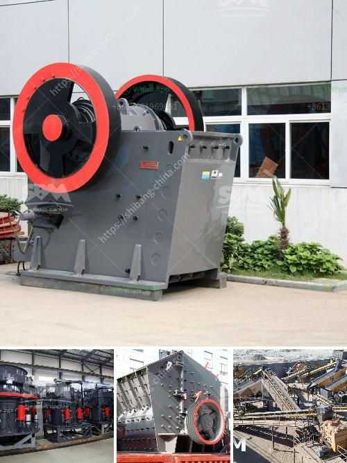

<h3>china make vertical roller mill</h3>
China, the world's largest producer of cement, has been making significant strides in the manufacturing and technological advancements of vertical roller mills. With its rich history in cement production, China is undoubtedly a frontrunner in this area, continuously working towards improved efficiency and sustainability. 

Vertical roller mills, also known as VRMs, have gained immense popularity in the cement industry over the past few decades. These mills offer several advantages over traditional ball mills, including higher grinding efficiency, reduced power consumption, and lower maintenance costs. The ability to grind materials, such as clinker and additives, to a fine powder with minimal noise and vibration has made VRMs the preferred choice in many cement plants worldwide.

China, recognizing the potential of vertical roller mills to revolutionize cement production, has invested heavily in research and development of this technology. Chinese manufacturers have successfully developed and produced high-quality, cost-effective VRMs that meet the stringent demands of the global market. 

One prominent example is CITIC Heavy Industries, a leading Chinese company specializing in the design and manufacturing of heavy machinery, including VRMs for cement production. CITIC's vertical roller mills have gained a reputation for their reliability, efficiency, and durability. These mills have been widely adopted by domestic cement manufacturers and have also been exported to countries across Asia, Africa, and the Americas.

Chinese manufacturers have also invested in advanced technologies to improve the performance and energy efficiency of vertical roller mills. For instance, the use of roller press technology in combination with VRMs has proven to be highly effective in reducing energy consumption and improving cement quality. By applying high-pressure grinding rolls before the VRM, the clinker can be pre-grinded, resulting in energy savings of up to 30%.

Furthermore, China's commitment to sustainability has been a driving force behind the development of eco-friendly VRMs. Many Chinese manufacturers have integrated advanced dust collection systems into their mills, significantly reducing particulate emissions. Additionally, the use of alternative fuels, such as shredded tires and biomass, in the combustion process has further decreased carbon emissions, contributing to a greener cement production process.

China's success in vertical roller mill manufacturing has not only strengthened its position as a global cement industry leader but also benefited other sectors. The technology and expertise developed by Chinese manufacturers have been adapted for various applications beyond cement production. For example, VRMs are now widely used in the coal, power generation, and chemical industries for grinding various materials.

In conclusion, China's investment in vertical roller mill technology has paid off, with its manufacturers producing state-of-the-art mills that are highly sought after worldwide. The continuous research and development efforts, along with the integration of advanced technologies and sustainable practices, have cemented China's position as a major player in the global cement industry. It is evident that the vertical roller mill market will continue to witness China's remarkable contributions, pushing the boundaries of efficiency, sustainability, and innovation.
<h3>Contact us</h3><ul><li><strong>Whatsapp:&nbsp;<a href="https://wa.me/8613661969651">+8613661969651</a></strong></li><li><a href="https://swt.shibang-china.com/?git&amp;zhl&amp;china make vertical roller mill"><strong>Online Service(chat now)</strong></a></li></ul><h3>Related</h3><ul><li><a href='crushing machine from china.md'>crushing machine from china</a></li><li><a href='stone crusher saudi.md'>stone crusher saudi</a></li><li><a href='how vertical roller mill works.md'>how vertical roller mill works</a></li><li><a href='price hammer mill price mill pulverizer.md'>price hammer mill price mill pulverizer</a></li><li><a href='mining calcium carbonate vietnam.md'>mining calcium carbonate vietnam</a></li></ul>