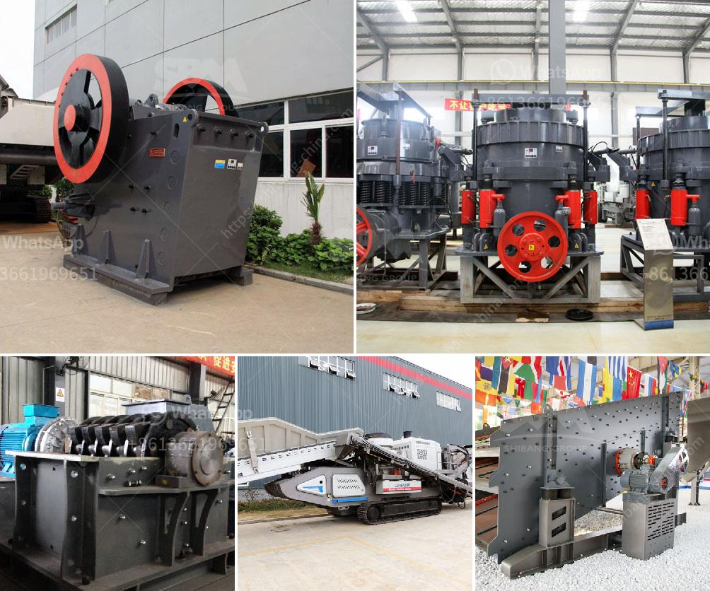

<h3>china mineral ore processing mill ball</h3>
China has become a powerhouse in the global mining industry in recent years. With its vast resources and rapidly growing economy, the country has witnessed a significant increase in the demand for mineral ores. To meet this growing demand, China has developed advanced technologies for mineral ore processing. One such technology is the mineral ore processing mill ball.

The mineral ore processing mill ball is a type of grinding mill, specifically designed for mineral ore grinding processes. The ball mill can grind various mineral ores, coal, cement, and other materials with dry type and wet type. There are two kinds of ball mills, grate type and overfall type, due to different ways of discharging material.

The development of the mineral ore processing mill ball can be attributed to China's commitment to improve its mining industry. With a booming economy heavily reliant on mineral resources, China has made substantial investments in mining technologies. The mineral ore processing mill ball is an outcome of these investments.

One of the significant advantages of the mineral ore processing mill ball is its energy efficiency. The grinding process consumes a lot of energy, so energy-efficient technologies are crucial to reducing production costs. The mineral ore processing mill ball adopts advanced grinding techniques, reducing energy consumption while maintaining high grinding efficiency. This not only lowers production costs for mining companies but also contributes to environmental sustainability.

Furthermore, the mineral ore processing mill ball offers a highly flexible and adaptable solution for mining operations. It can be customized to process various mineral ores, allowing mining companies to efficiently extract valuable minerals from their reserves. The mill ball can adapt to different ore types, ensuring optimal grinding performance and maximizing mineral recovery. This versatility is particularly advantageous in China, where the country's diverse mineral resources require specialized processing technologies.

The mineral ore processing mill ball has also contributed to improving the quality and purity of Chinese mineral products. With its precise grinding capabilities, the mill ball can achieve finer particle sizes and produce high-quality mineral powders. This has helped Chinese mining companies meet the stringent quality requirements set by domestic and international markets. As a result, Chinese mineral products have gained a reputation for their consistency and reliability, making them highly sought after in the global market.

In conclusion, the mineral ore processing mill ball has revolutionized China's mining industry. Its energy efficiency, flexibility, and ability to produce high-quality mineral powders have significantly enhanced the country's mining capabilities. As China continues to develop and expand its mining sector, the mineral ore processing mill ball will play a crucial role in unlocking the potential of its mineral resources. With ongoing technological advancements, the mill ball is expected to further improve its performance and contribute to the sustainable growth of China's mining industry.
<h3>Contact us</h3><ul><li><strong>Whatsapp:&nbsp;<a href="https://wa.me/8613661969651">+8613661969651</a></strong></li><li><a href="https://swt.shibang-china.com/?git&amp;zhl&amp;china mineral ore processing mill ball"><strong>Online Service(chat now)</strong></a></li></ul><h3>Related</h3><ul><li><a href='coal crusher manufacturing machine.md'>coal crusher manufacturing machine</a></li><li><a href='coal pulverizer machine.md'>coal pulverizer machine</a></li><li><a href='hydraulic cone crusher application.md'>hydraulic cone crusher application</a></li><li><a href='to buy a second hand mobile stone crusher plant india.md'>to buy a second hand mobile stone crusher plant india</a></li><li><a href='sri lankan building sand price.md'>sri lankan building sand price</a></li></ul>