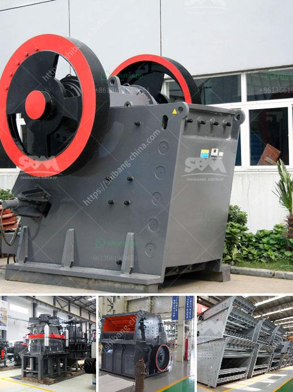

<h3>china quarry crushing production line equipment</h3>
China has a rich quarrying industry that dates back to ancient times. Nowadays, the quarry crushing production line equipment has been widely used in many industries, such as mining, metallurgy, building materials, highway, railway, water conservancy, and chemical industry. The quarry crushing production line mainly consists of vibrating feeder, jaw crusher, impact crusher, vibrating screen, belt conveyor, and centralized electronic control equipment. 

The quarry crushing production line equipment has the characteristics of reliable performance, reasonable design, convenient operation, and high work efficiency. In the quarry crushing production process, it is inevitable to encounter various problems and obstacles. Therefore, the equipment needs to be selected reasonably and operated in strict accordance with the instructions to ensure the smooth progress of the production line. 

China's quarry crushing production line equipment has been continuously improved and upgraded in recent years. The advanced technology and equipment have been successfully applied in many large-scale projects, effectively improving the overall efficiency and production capacity of the quarrying industry. 

The vibrating feeder is responsible for uniform feeding of the materials into the jaw crusher, which can perform coarse crushing of large pieces of stone. The jaw crusher is the core equipment of the quarry crushing production line. It has the advantages of large crushing ratio, high production capacity, simple structure, and easy maintenance. The impact crusher is used for secondary crushing, and it has the characteristics of high crushing efficiency, even particle size, and good shape of finished products. 

After being crushed by the impact crusher, the materials are sent to the vibrating screen through the belt conveyor for screening. The vibrating screen is responsible for separating the materials into different sizes according to the requirements of the production process. The final products with qualified particle size are sent to the finished material pile by the belt conveyor, while the materials that do not meet the requirements are returned to the impact crusher for re-crushing. 

In conclusion, China's quarry crushing production line equipment plays a crucial role in the quarrying industry. With its reliable performance, high work efficiency, and advanced technology, it provides strong support for the sustainable development of the industry. The continuous improvement and upgrading of equipment have effectively improved the overall production capacity and efficiency of the quarrying industry, contributing to China's economic development.
<h3>Contact us</h3><ul><li><strong>Whatsapp:&nbsp;<a href="https://wa.me/8613661969651">+8613661969651</a></strong></li><li><a href="https://swt.shibang-china.com/?git&amp;zhl&amp;china quarry crushing production line equipment"><strong>Online Service(chat now)</strong></a></li></ul><h3>Related</h3><ul><li><a href='sales of conveyor belts.md'>sales of conveyor belts</a></li><li><a href='size to a jaw crusher and cone crusher.md'>size to a jaw crusher and cone crusher</a></li><li><a href='rolling ball mills manufacturer.md'>rolling ball mills manufacturer</a></li><li><a href='copper concentrate processing equipment.md'>copper concentrate processing equipment</a></li><li><a href='silico manganese manufacturing equipment.md'>silico manganese manufacturing equipment</a></li></ul>