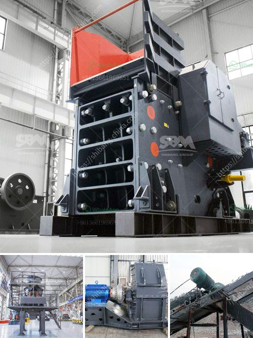

<h3>china ultra fine grinders mill</h3>
In recent years, China’s economy has been rapidly developing, and the demand for minerals, chemicals, and other materials has been steadily increasing. With this rise in demand comes the need for machinery that can efficiently and effectively grind these materials into fine particles. Enter the ultra fine grinders mill, a revolutionary piece of equipment that has taken the grinding industry by storm.

Ultra fine grinders mill, also known as ultrafine grinding mill or ultrafine mill, is an energy-efficient grinding equipment developed by China's grinding technology experts. It combines advanced grinding technology in China and abroad and has been widely used in various fields, such as the production of quartz sand, silica sand, refractory materials, metallurgy, building materials, chemicals, mining minerals in areas such as grinding materials processing.

The ultra fine grinders mill has many advantages over traditional grinding mills. Firstly, it utilizes a highly efficient and energy-saving centrifugal fan that greatly reduces power consumption. This not only lowers production costs but also contributes to a greener environment. Secondly, the mill adopts a unique structure design, allowing for easy maintenance and operation. With its integrated control system, operators can adjust the fineness of the final product according to their specific requirements.

But what sets the ultra fine grinders mill apart from other grinding mills is its ability to produce ultra-fine particles. This technology is achieved through the combination of high-precision classification and closed-circuit grinding, resulting in a final product with a particle size of between 325 and 2500 mesh (47-5 microns). This level of fineness is difficult to achieve with traditional grinding mills, making the ultra fine grinders mill a game-changer in the industry.

The applications of the ultra fine grinders mill are vast and varied. It is commonly used in industries such as mining, chemical engineering, construction materials, and metallurgy for grinding materials with Mohs hardness below 9 and humidity below 6%. It can grind various non-flammable and non-explosive minerals, including quartz, feldspar, calcite, talc, barite, fluorite, rare earth, marble, ceramic, bauxite, manganese ore, iron ore, copper ore, and more.

In conclusion, the ultra fine grinders mill has revolutionized the grinding industry in China. Its energy-efficient design, easy maintenance, and ability to produce ultra-fine particles make it an invaluable asset for various industries. As China’s economy continues to grow, the demand for ultra fine grinders mill will only increase. With its advanced technology and superior performance, it is clear that the ultra fine grinders mill is the path to fine grinding in China.
<h3>Contact us</h3><ul><li><strong>Whatsapp:&nbsp;<a href="https://wa.me/8613661969651">+8613661969651</a></strong></li><li><a href="https://swt.shibang-china.com/?git&amp;zhl&amp;china ultra fine grinders mill"><strong>Online Service(chat now)</strong></a></li></ul><h3>Related</h3><ul><li><a href='micro grinding machine.md'>micro grinding machine</a></li><li><a href='buy stone crusher.md'>buy stone crusher</a></li><li><a href='process of making quartz marble crusher.md'>process of making quartz marble crusher</a></li><li><a href='hydraulic stone crusher for hire uk.md'>hydraulic stone crusher for hire uk</a></li><li><a href='ethiopia conveyor belts china.md'>ethiopia conveyor belts china</a></li></ul>