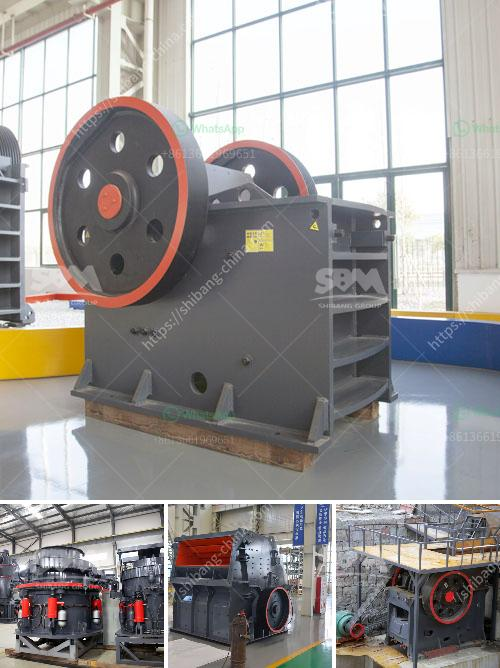

<h3>chrome crushing plant</h3>
Mining is often considered a high-risk industry, but it also holds the potential for high rewards. The global demand for metals like chrome is growing rapidly, and mining operations around the world are increasing their production to meet this demand. A crucial component of any modern mining operation is a chrome crushing plant.

Chrome mining extraction process is usually conducted in an open-pit quarry. The extracted chrome ore will be transported to the chrome crusher for further processing. The process includes crushing, screening, grinding, beneficiation, and drying. In the crushing process, the raw materials will be fed into primary jaw crusher by vibrating feeder for the first crushing. The crushed material will be transferred to the secondary impact crusher for further crushing. The crushed chrome ore will be then processed by vibrating screen for separating. After screening, the chrome ore will be transported to the ball mill for further grinding, and then gravity separation and flotation separation will be used to separate the chrome tailings and obtain concentrate. Finally, drying machines will be used to remove the surface moisture of the concentrate, resulting in a final product ready for shipment.

A chrome crushing plant plays a crucial role in processing chrome ore to ensure a maximum recovery of the resource. It is universally acknowledged that chrome ore beneficiation techniques are essential processes in many industries, especially in the metal, chemical, and construction sectors. Chrome crushing plants can be classified into two main categories: mobile chrome crushing plants and stationary chrome crushing plants. More importantly, both types have great advantages in terms of production capacity, physical features, and operational flexibility.

Whether stationary or mobile, a chrome crushing plant can be customized according to the specific production requirements. Different from traditional crushers, chrome crushing plants have improved safety features, durability, automation, energy-saving, and low maintenance requirements. These advancements help mining companies streamline their production processes, reduce environmental impact, and increase operational efficiency.

Furthermore, installing a chrome crushing plant allows mining companies to reduce transportation costs and maximize the use of the extracted chrome ore. The chrome crushing plant can be operated remotely, providing a safe operating environment for workers. The automated processes also guarantee consistent performance and high-quality output.

Another advantage of a chrome crushing plant is its versatility. The processed chrome ore can be used in various industries, such as stainless steel production, chemical manufacturing, and refractory material production. With increasing demand and limited supply, having a chrome crushing plant in place is crucial for mining companies aiming to remain competitive in the global market.

In conclusion, a chrome crushing plant is a crucial investment for mining companies. It enables efficient extraction of chrome ore, resulting in increased productivity and profits. The versatility and automated features of modern chrome crushing plants ensure consistent high-quality output while minimizing operational costs. As the global demand for chrome continues to rise, investing in a chrome crushing plant can help mining companies stay competitive and meet the growing market demands.
<h3>Contact us</h3><ul><li><strong>Whatsapp:&nbsp;<a href="https://wa.me/8613661969651">+8613661969651</a></strong></li><li><a href="https://swt.shibang-china.com/?git&amp;zhl&amp;chrome crushing plant"><strong>Online Service(chat now)</strong></a></li></ul><h3>Related</h3><ul><li><a href='start a stone crusher.md'>start a stone crusher</a></li><li><a href='crushing processing equipment.md'>crushing processing equipment</a></li><li><a href='jaw crusher malaysia.md'>jaw crusher malaysia</a></li><li><a href='jual jaw crusher second hand.md'>jual jaw crusher second hand</a></li><li><a href='rotary kiln producers in indonesia.md'>rotary kiln producers in indonesia</a></li></ul>