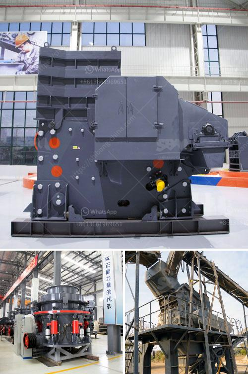

<h3>chrome ore refinery processing plant</h3>
Chrome ore is one of the most abundant minerals found on Earth's surface. It is used in various industries including construction, metallurgy, and chemical manufacturing. Having a chrome ore refinery processing plant ensures a steady supply of chrome concentrate, which can be further processed into various end products.

A chrome ore refinery processing plant is designed to extract chromium from chrome ore deposits. The plant uses various beneficiation methods to extract the chromium, including gravity separation, froth flotation, magnetic separation, and chemical leaching. These techniques are used to remove impurities such as silica, iron, and alumina, which are commonly found in the ore.

The first step in the process is crushing the chrome ore into smaller particles. This allows for easier separation of the different components in the ore. The crushed ore is then fed into a series of screens and classifiers to separate it into different size fractions. The classified ore is then sent to the processing plant via conveyor belts.

At the processing plant, the chrome ore is subjected to a series of physical and chemical treatments to separate the valuable chromium from the impurities. Gravity separation is often used as the first step in the process to separate lighter particles from heavier ones. Froth flotation is then employed to further separate the chromite from other minerals, using selective reagents. Magnetic separation is used to remove magnetic minerals, while chemical leaching can extract chromium from the remaining non-magnetic fraction.

Once the chromite concentrate has been obtained, it can be further processed into various end products. One common product is ferrochrome, a type of alloy that contains chromium and iron. Ferrochrome is used in the production of stainless steel, as it imparts corrosion resistance and enhances the strength and durability of the finished product. Other end products include chrome-iron and chrome-nickel alloys, which find applications in the manufacturing of automobile parts, aircraft components, and industrial machinery.

A chrome ore refinery processing plant offers a range of economic benefits. Firstly, it helps to optimize the use of natural resources by extracting chrome from low-grade ore deposits that would otherwise be discarded. This not only ensures a steady supply of chrome concentrate but also reduces the environmental impact associated with mining activities. Additionally, the processing plant creates employment opportunities for local communities and contributes to their economic development.

In conclusion, a chrome ore refinery processing plant plays a crucial role in extracting valuable chromium from chrome ore deposits. It utilizes various beneficiation techniques to separate the chromite from impurities, resulting in the production of chrome concentrate. This concentrate can then be processed into a range of end products, including ferrochrome and chrome alloys, which find extensive use in industries such as construction and metallurgy. The establishment of such plants promotes sustainable resource utilization and offers economic benefits to local communities.
<h3>Contact us</h3><ul><li><strong>Whatsapp:&nbsp;<a href="https://wa.me/8613661969651">+8613661969651</a></strong></li><li><a href="https://swt.shibang-china.com/?git&amp;zhl&amp;chrome ore refinery processing plant"><strong>Online Service(chat now)</strong></a></li></ul><h3>Related</h3><ul><li><a href='cost of a conveyor belt systems for mining.md'>cost of a conveyor belt systems for mining</a></li><li><a href='marble crusher for sale in portugal.md'>marble crusher for sale in portugal</a></li><li><a href='harga mesin raymond mill indonesia.md'>harga mesin raymond mill indonesia</a></li><li><a href='stone crusher plant manufacturer.md'>stone crusher plant manufacturer</a></li><li><a href='rock crusher distributors in denver colorado.md'>rock crusher distributors in denver colorado</a></li></ul>