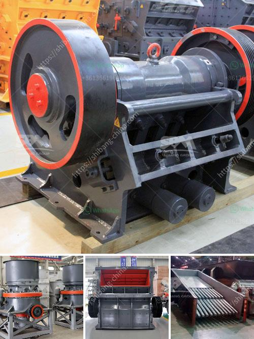

<h3>chromite ore beneficiation processing</h3>
Chromite is an important mineral used in the production of stainless steel, as well as other industrial and chemical applications. Chromite ore is typically mined from underground and surface operations, and then processed through a series of beneficiation steps to produce a high-quality, marketable chromite concentrate.

The beneficiation process of chromite ore involves crushing, grinding, screening, gravity separation and magnetic separation. Each of these steps is designed to remove a specific type of impurity from the chromite ore, while ensuring the chromite particles are properly liberated for subsequent chemical or physical processing.

The first step in the beneficiation process is the crushing of the chromite ore. This involves breaking the ore into smaller pieces that are suitable for further processing. After crushing, the ore is finely ground to a fine, uniform size using a ball mill or similar equipment. This grinding process helps to liberate the chromite particles from the gangue minerals, allowing for easier separation.

Once the ore is finely ground, it is subjected to a series of separation techniques. First, gravity separation is used to remove any heavy minerals or gangue materials that have a higher density than chromite. This is typically achieved using spirals or shaking tables, where the heavier gangue particles are separated from the lighter chromite particles.

Next, magnetic separation is employed to remove any magnetic impurities from the chromite concentrate. This is done by passing the concentrate through a magnetic separator, which attracts and retains the magnetic particles, while allowing the non-magnetic chromite particles to pass through.

Finally, the chromite concentrate is further processed through a series of chemical or physical processes to produce a marketable product. This may involve additional grinding, sizing, flotation or roasting steps, depending on the desired final product specifications.

Overall, chromite ore beneficiation processing involves several steps to produce a high-quality chromite concentrate. These steps include crushing, grinding, screening, gravity separation, magnetic separation, and further processing. By effectively removing impurities and liberating the chromite particles, this process helps to maximize the economic value of the chromite ore.
<h3>Contact us</h3><ul><li><strong>Whatsapp:&nbsp;<a href="https://wa.me/8613661969651">+8613661969651</a></strong></li><li><a href="https://swt.shibang-china.com/?git&amp;zhl&amp;chromite ore beneficiation processing"><strong>Online Service(chat now)</strong></a></li></ul><h3>Related</h3><ul><li><a href='crushing equipment manufacturer.md'>crushing equipment manufacturer</a></li><li><a href='sand manufacturing machines china.md'>sand manufacturing machines china</a></li><li><a href='quarry crusher in zambia.md'>quarry crusher in zambia</a></li><li><a href='granite quarrying process.md'>granite quarrying process</a></li><li><a href='alluvial chrome wash plant in the usa.md'>alluvial chrome wash plant in the usa</a></li></ul>