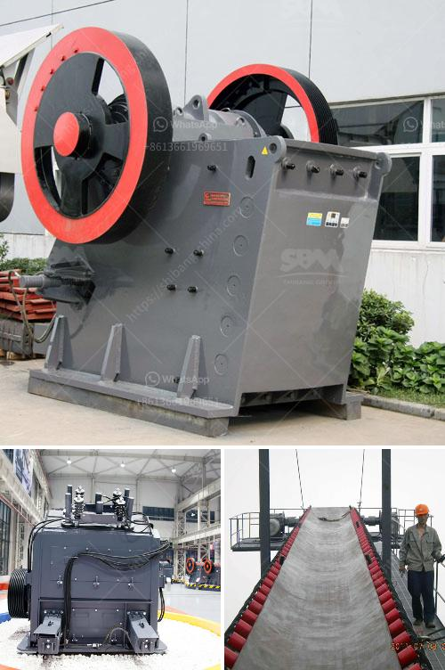

<h3>chromite processing plant and separation machine</h3>
Chromite is a mineral composed primarily of iron, magnesium, and chromium oxide. It is categorized as one of the strategic and critical minerals due to its various industrial applications, particularly in the production of stainless steel and other alloys. As a result, the demand for chromite has been steadily increasing, making efficient processing plants and separation machines crucial for the chromite mining industry.

A chromite processing plant is a highly automated plant that facilitates the separation of valuable chromite from unwanted impurities. In order to produce pure chromite, various physical and chemical processes need to be employed. The plant consists of various stages, including crushing, grinding, and magnetic separation, that help in the rapid and efficient transformation of raw chromite ore into a usable product.

The first stage in the chromite processing plant is the extraction of raw material from the mine. This involves drilling, blasting, and the use of explosives to loosen the ore from the surrounding rock. Once extracted, the raw chromite is transported to the crushing unit, where it is crushed to a size suitable for further processing. At this stage, jaw crushers and cone crushers are commonly used to reduce the size of the ore.

The next stage is grinding, which involves the use of mills to pulverize the crushed ore into fine particles. This process improves the efficiency of subsequent separation processes by exposing a greater surface area of the ore to chemical reagents. The ground chromite is then subjected to magnetic separation. A magnetic separator machine uses magnets to attract and remove impurities from the chromite, resulting in a concentrate that is enriched in chromite content.

Another vital stage in the chromite processing plant is the drying and packaging of the final product. Once separated, the chromite concentrate needs to be dried to reduce moisture content. This is typically achieved by passing the concentrate through a rotary dryer. After drying, the chromite concentrate is packaged in bags or bulk containers, ready for transportation to various industries that utilize chromite for diverse applications.

In recent years, advancements in technology have led to the development of more efficient and environmentally friendly chromite processing plants and separation machines. In addition to traditional methods, innovative techniques such as froth flotation have been incorporated to enhance the separation process. Froth flotation utilizes bubbles to selectively separate chromite from other minerals based on their surface properties, resulting in improved separation efficiency.

Efficient chromite processing plants and separation machines are instrumental in meeting the growing demand for chromite and ensuring a sustainable supply of this critical mineral. By maximizing the recovery of valuable chromite and minimizing waste, these plants play a crucial role in the overall efficiency and profitability of the chromite mining industry. As technology continues to evolve, we can expect further advancements in chromite processing and separation techniques, thus improving the overall productivity and environmental sustainability of the process.
<h3>Contact us</h3><ul><li><strong>Whatsapp:&nbsp;<a href="https://wa.me/8613661969651">+8613661969651</a></strong></li><li><a href="https://swt.shibang-china.com/?git&amp;zhl&amp;chromite processing plant and separation machine"><strong>Online Service(chat now)</strong></a></li></ul><h3>Related</h3><ul><li><a href='concrete crusher for rent qatar.md'>concrete crusher for rent qatar</a></li><li><a href='rock crushers cost tons per hour.md'>rock crushers cost tons per hour</a></li><li><a href='suppliers of mining mills in south africa.md'>suppliers of mining mills in south africa</a></li><li><a href='used crusher for sale in south africa.md'>used crusher for sale in south africa</a></li><li><a href='china quarry crushing production line equipment.md'>china quarry crushing production line equipment</a></li></ul>