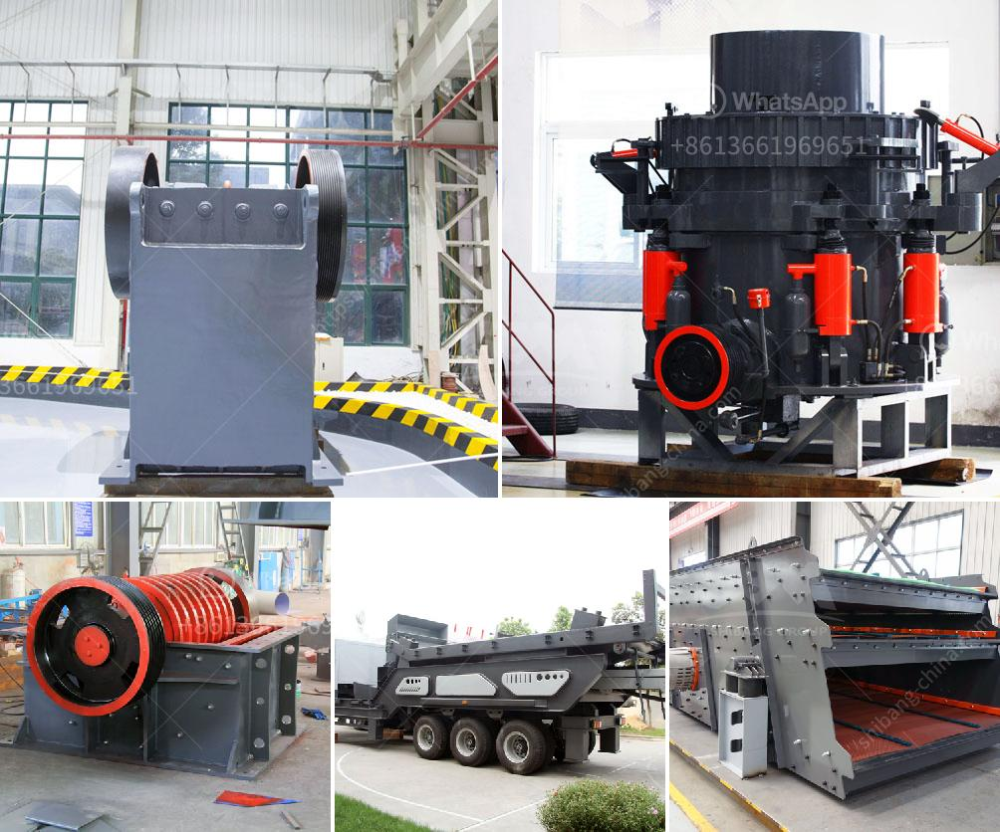

<h3>clay crusher manufacturing process</h3>
Clay crushers are used primarily for crushing clay and other minerals that are found in abundance around the world. Clay minerals are essential raw materials for creating ceramic products, such as tiles, bricks, and pottery. In order to create high-quality ceramic products, proper crushing processes are required to ensure the clay minerals are finely ground and ready for further processing.

1. Extraction: Clay can be extracted from different sources, such as mines or quarries. The clay to be crushed is usually excavated, transported, and stored in stockpiles to ensure continuous supply to the manufacturing process.

2. Crushing: The clay extracted from the source is then crushed into smaller pieces using jaw crushers or gyratory crushers. These crushers break down large chunks of clay into smaller, more manageable sizes, allowing for easier handling and further processing.

3. Grinding: After the initial crushing stage, the clay is further ground into a fine powder. This grinding process is typically carried out using ball mills, which are rotating cylindrical drums that contain steel balls. As the drum rotates, the balls collide with the clay, crushing and grinding it into a homogenous powder.

4. Screening: Once the clay has been finely ground, it is passed through screens to separate any impurities or oversized particles. This screening process ensures that only the finest clay particles are used, resulting in a higher-quality end product.

5. Mixing and Blending: The finely ground clay powder is then mixed with other raw materials, such as water, sand, or fluxes, depending on the desired ceramic product. This blending process ensures that the clay is properly mixed with other materials to achieve the desired composition and properties.

6. Forming: Once the clay mixture is properly blended, it is then molded into the desired shape. Various techniques, such as extrusion, slip casting, or pressing, can be used to form the clay into tiles, bricks, or pottery.

7. Drying: After the clay has been formed into the desired shape, it is dried to remove any moisture. This drying process can be carried out naturally, by air-drying the clay, or using specialized drying equipment, such as kilns or dryers.

8. Firing: The final step in the clay crusher manufacturing process is firing the dried clay products in kilns. This firing process involves subjecting the clay to high temperatures, which causes it to harden and become ceramic. The firing temperature and duration can vary depending on the type of clay and desired final product.

In conclusion, the manufacturing process of clay crushers is a complex and intricate process that involves several steps, from clay extraction to the final firing of the ceramic products. Each step of the process is crucial in ensuring the production of high-quality clay crushers that meet the specific requirements of the ceramic industry. Proper crushing and processing of clay minerals are essential in producing ceramic products that are durable, aesthetically pleasing, and functional.
<h3>Contact us</h3><ul><li><strong>Whatsapp:&nbsp;<a href="https://wa.me/8613661969651">+8613661969651</a></strong></li><li><a href="https://swt.shibang-china.com/?git&amp;zhl&amp;clay crusher manufacturing process"><strong>Online Service(chat now)</strong></a></li></ul><h3>Related</h3><ul><li><a href='grinding machines for minerals in indonesia.md'>grinding machines for minerals in indonesia</a></li><li><a href='fine grinding mill specifications.md'>fine grinding mill specifications</a></li><li><a href='concrete crusher hire price in south africa.md'>concrete crusher hire price in south africa</a></li><li><a href='size to a jaw crusher and cone crusher.md'>size to a jaw crusher and cone crusher</a></li><li><a href='prices of harmer mills in south africa.md'>prices of harmer mills in south africa</a></li></ul>