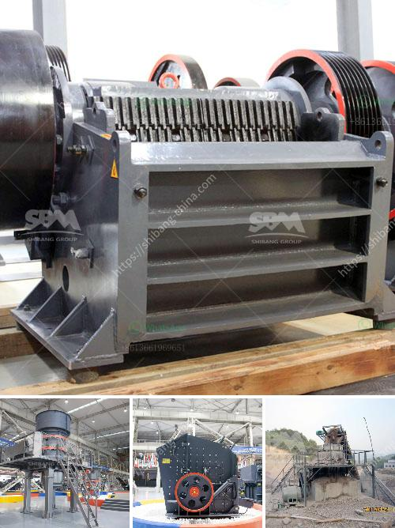

<h3>clinker grinding mill germany price</h3>
Cement production is an energy-intensive process, requiring significant amounts of raw materials and fuel. One crucial step in this process is the grinding of clinker formed from heated limestone and clay. However, grinding clinker into fine powder requires substantial energy consumption. Hence, the availability of a high-quality and cost-effective clinker grinding mill is crucial for cement manufacturers in Germany.

Germany has a well-established cement industry, with several players operating in the market. These manufacturers understand the importance of investing in cutting-edge technology to stay competitive and reduce their environmental footprint. One such technological advancement is the clinker grinding mill.

The clinker grinding mill is a reliable and efficient device for finely grinding cement clinker. Its key features include a powerful motor, a large grinding chamber, and a compact design. These features make it an ideal choice for grinding various types of cement clinker, including coal ash, blast furnace slag, and other industrial waste materials. Importantly, it also reduces the energy consumption associated with the grinding process.

The price of a clinker grinding mill in Germany ranges from several hundred thousand to millions of euros, depending on the specific model and capacity. While the upfront cost may seem substantial, the long-term benefits outweigh the initial investment. The reduced energy consumption enabled by the mill yields significant cost savings over time, making it a financially viable option.

Furthermore, the clinker grinding mill's advanced design and automation capabilities help increase the overall efficiency of cement production. Manufacturers can easily control and monitor the grinding process, ensuring consistent quality and minimizing downtime. The mill's compact design also allows for easy installation, maintenance, and expansion, providing flexibility as production demands fluctuate.

In addition to its cost-effective and efficient operation, the clinker grinding mill contributes to sustainability efforts within the cement industry. By grinding clinker to a finer size, manufacturers can reduce the amount of clinker required for cement production. This not only conserves natural resources but also reduces greenhouse gas emissions associated with clinker manufacturing. Moreover, the mill's low noise and vibration levels positively impact the working environment for operators.

Germany's focus on sustainable development and its stringent environmental regulations make the clinker grinding mill a valuable asset for cement manufacturers. It aligns with the country's commitment to reducing carbon emissions and achieving carbon neutrality in the future. Embracing this technology demonstrates the industry's dedication to meeting global climate goals and ensures a competitive position in both domestic and international markets.

In conclusion, the clinker grinding mill Germany price may initially seem high. However, the long-term benefits of reduced energy consumption, increased efficiency, and sustainability make it a worthwhile investment for cement manufacturers. By incorporating this advanced technology into their operations, German cement producers can improve productivity, lower costs, and contribute to a greener future.
<h3>Contact us</h3><ul><li><strong>Whatsapp:&nbsp;<a href="https://wa.me/8613661969651">+8613661969651</a></strong></li><li><a href="https://swt.shibang-china.com/?git&amp;zhl&amp;clinker grinding mill germany price"><strong>Online Service(chat now)</strong></a></li></ul><h3>Related</h3><ul><li><a href='super fine grinding machine in sri lanka.md'>super fine grinding machine in sri lanka</a></li><li><a href='cost of a conveyor belt systems for mining.md'>cost of a conveyor belt systems for mining</a></li><li><a href='crusher plants in sri lanka.md'>crusher plants in sri lanka</a></li><li><a href='iron ore concentrate plant tpa production.md'>iron ore concentrate plant tpa production</a></li><li><a href='processing of delomite powder mill.md'>processing of delomite powder mill</a></li></ul>