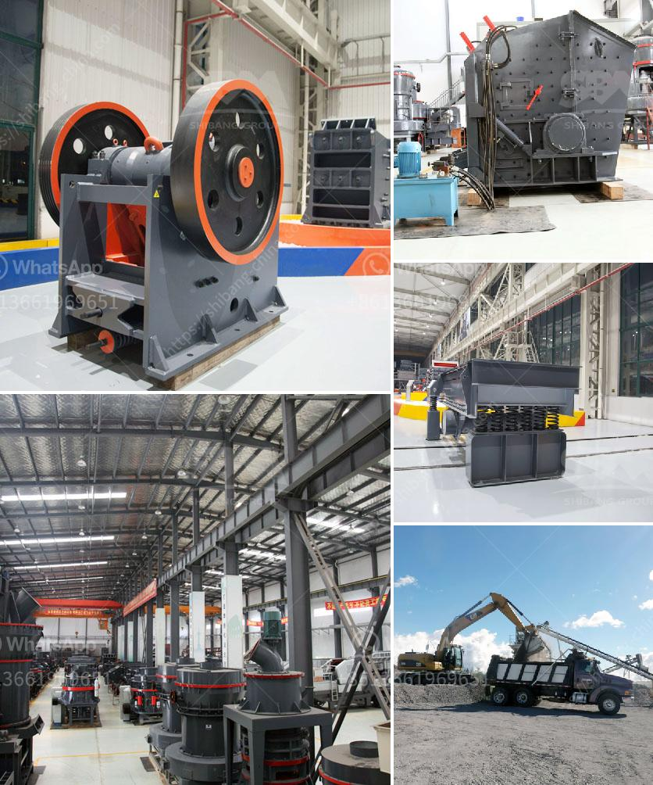

<h3>clinker grinding unit prices</h3>
Clinker is a necessary component in the production of cement, which is widely used in various construction projects. To obtain clinker, the raw materials used in the cement manufacturing process are ground in a grinding unit, resulting in fine powder. These clinker grinding units are essential for obtaining high-quality cement and ensuring its strength and durability.

The prices of clinker grinding units vary depending on several factors. One crucial factor is the size of the unit. Clinker grinding units come in different capacities, ranging from several tons to more than a hundred tons per hour. The larger the capacity, the higher the price of the unit.

Another factor that affects the price is the technology used in the unit. Advanced technology allows for more efficient grinding, leading to higher productivity and better quality cement. However, units with advanced technology tend to have higher prices due to the additional costs associated with research and development and equipment upgrades.

The location of the clinker grinding unit can also impact its price. Units located in regions with high labor or energy costs may have higher prices compared to units in regions with lower costs. Additionally, transportation costs can influence the price, especially if the unit is far from the source of clinker or the market for cement.

The quality and durability of the unit itself also play a role in determining its price. Units made with high-quality materials and components are generally more expensive but can provide better performance and longevity. Investing in a reliable and durable unit can save costs in the long run by minimizing maintenance and repair expenses.

Furthermore, the cost of land and infrastructure required for setting up a clinker grinding unit can impact its price. Units located in areas with higher land and infrastructure costs may have higher prices. Additionally, regulatory requirements and permits necessary for establishing and operating the unit can add to the overall cost.

When purchasing a clinker grinding unit, it is essential to consider not only the initial price but also the total cost of ownership. This includes maintenance and operational costs, energy consumption, and the unit's overall efficiency. Opting for a more expensive unit with better performance and energy efficiency may result in cost savings in the long term.

In conclusion, clinker grinding unit prices vary depending on factors such as capacity, technology, location, quality, and total cost of ownership. It is crucial for buyers to consider these factors and conduct thorough research to choose a unit that meets their requirements and provides the best value for their investment.
<h3>Contact us</h3><ul><li><strong>Whatsapp:&nbsp;<a href="https://wa.me/8613661969651">+8613661969651</a></strong></li><li><a href="https://swt.shibang-china.com/?git&amp;zhl&amp;clinker grinding unit prices"><strong>Online Service(chat now)</strong></a></li></ul><h3>Related</h3><ul><li><a href='to 200 tph pe 750 1060 copper ore jaw crusher.md'>to 200 tph pe 750 1060 copper ore jaw crusher</a></li><li><a href='aggregate crusher plant keesara.md'>aggregate crusher plant keesara</a></li><li><a href='project report for stone crushing plant.md'>project report for stone crushing plant</a></li><li><a href='malaysia heavy industries crushing equipment china.md'>malaysia heavy industries crushing equipment china</a></li><li><a href='suppliers of crush or rocks pretoria.md'>suppliers of crush or rocks pretoria</a></li></ul>