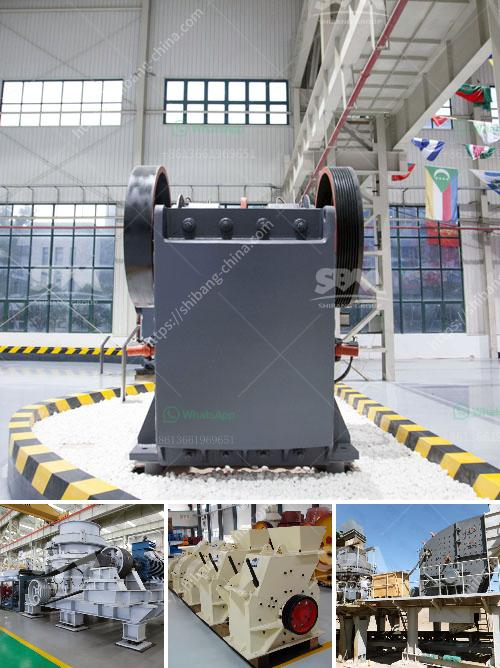

<h3>closed quarrz plants in kenya</h3>
Quartz, a valuable mineral found abundantly in Kenya, has become a sought-after resource globally due to its various industrial applications. However, the closure of quartz plants in the country has become a significant concern. This article aims to shed light on the reasons behind these closures and the subsequent impact on the local economy and workforce.

Kenya is blessed with vast quartz deposits, mostly found in the coastal region. Quartz is a mineral renowned for its high resistance to extreme temperatures, making it indispensable in the production of glass, ceramics, and even high-quality silicon chips used in electronics. The quartz mining industry in Kenya has traditionally played a crucial role in the country's economy, providing employment opportunities and contributing to foreign exchange earnings.

The unfortunate reality is that many quartz plants in Kenya have shut down in recent years. Several factors have contributed to these closures. Firstly, a decline in demand for quartz due to global economic slowdowns and the emergence of alternative materials has negatively impacted the industry. Additionally, inadequate infrastructure such as inadequate roads, water, and electricity supply has made operations difficult for these plants. Furthermore, rising operational costs, including transport and raw material expenses, have made it increasingly challenging for these plants to sustain profitability.

The closure of quartz plants has had a detrimental effect on the local economy. The loss of jobs has created unemployment among workers who were highly dependent on the industry. This has resulted in increased poverty levels, affecting the livelihoods of many families and exacerbating the already existing economic disparities. Additionally, the local communities that relied on these plants for their economic sustenance have experienced a decline in purchasing power, leading to a decrease in the overall demand for goods and services and a stagnation of growth in nearby businesses.

To revive the quartz mining industry in Kenya, concerted efforts are needed from both the government and private sector. Firstly, the government should prioritize infrastructure development, particularly improving road networks, water supply, and electricity access in regions with significant quartz deposits. This will reduce operational costs and attract investors back to the sector. Additionally, the government could provide incentives such as tax breaks to encourage investments in the industry and promote export opportunities.

Collaboration with international organizations experienced in quartz mining could also prove beneficial. These organizations can provide technical assistance, share best practices, and offer training programs to improve mining techniques. Furthermore, there is a need to diversify the applications of quartz and explore new markets, such as advanced technologies and renewable energy sectors, which are experiencing rapid growth globally.

The closure of quartz plants in Kenya is undoubtedly a significant setback for the country's economy and the local workforce. Urgent action is required to address the issues that have contributed to these closures and to create an environment conducive to the revitalization of the quartz mining industry. By implementing necessary reforms, the government can attract investment, create employment opportunities, and ensure sustainable economic growth for the country.
<h3>Contact us</h3><ul><li><strong>Whatsapp:&nbsp;<a href="https://wa.me/8613661969651">+8613661969651</a></strong></li><li><a href="https://swt.shibang-china.com/?git&amp;zhl&amp;closed quarrz plants in kenya"><strong>Online Service(chat now)</strong></a></li></ul><h3>Related</h3><ul><li><a href='gypsum manufacturer in ethiopia.md'>gypsum manufacturer in ethiopia</a></li><li><a href='gold corporation ball mill.md'>gold corporation ball mill</a></li><li><a href='vibratory screen south africa.md'>vibratory screen south africa</a></li><li><a href='ethiopia conveyor belts china.md'>ethiopia conveyor belts china</a></li><li><a href='impact crusher china.md'>impact crusher china</a></li></ul>