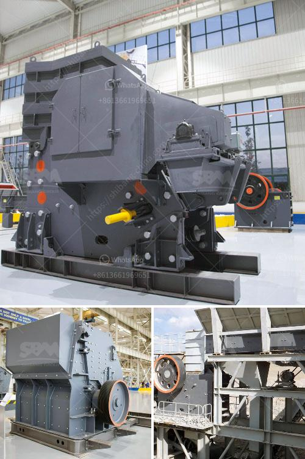

<h3>coal crusher infomation requirments</h3>
Coal, a fossil fuel, is the largest source of energy for the generation of electricity worldwide. It is also used for industrial purposes, such as producing steel and cement. To make the best use of coal, it needs to be crushed into different sizes according to the requirements of various industries. In this article, we will explore the information requirements for a coal crusher.

A coal crusher is a piece of equipment used to crush coal into small enough pieces to be transported to the processing plant for further refining. Crushing coal is essential to the efficient and sustainable use of this highly abundant resource. Here are some key requirements to consider when selecting a coal crusher:

1. Feed size: The feed size of the coal plays a vital role in the crushing process. It is generally recommended to have a maximum feed size of about 3/4th of the outlet opening. This ensures that the coal is properly crushed and does not cause any blockages in the crusher or downstream processes.

2. Capacity: The capacity of the crusher refers to the maximum amount of coal that can be processed in a specific time period. It is generally measured in tons per hour (TPH). The capacity requirement for a coal crusher depends on the size and type of coal being crushed, the final product size required, and the properties of the coal.

3. Crushing ratio: The crushing ratio is the ratio of the size of the feed material to the size of the crushed product. It indicates how efficient the crusher is in reducing the size of the coal particles. Typical crushing ratios for coal crushers range from 4:1 to 6:1. The higher the crushing ratio, the smaller the final product size.

4. Power requirements: The power requirements for a coal crusher depend on its capacity, the feed size, and the crushing ratio. Generally, a higher capacity crusher will require higher power consumption. It is essential to choose a crusher that is energy efficient and capable of crushing the desired amount of coal without consuming excessive power.

5. Maintenance and operating costs: The crusher's maintenance and operating costs should also be taken into consideration. This includes the cost of regular inspections, lubrication, and repairs. It is advisable to choose a crusher that is reliable, durable, and easy to maintain. Additionally, the cost of spare parts should be evaluated to ensure their availability and affordability.

6. Safety considerations: Safety is of paramount importance when selecting a coal crusher. It is critical to choose a crusher that complies with all relevant safety standards and regulations. The crusher should have safety features, such as emergency stop buttons, guards, and safety interlocks, to prevent accidents and protect the operators and maintenance personnel.

In conclusion, selecting the right coal crusher is essential for efficient and sustainable coal utilization. The feed size, capacity, crushing ratio, power requirements, maintenance and operating costs, and safety considerations are crucial factors to consider when making a decision. By assessing these requirements and selecting a suitable crusher, industries can enhance their coal crushing processes and optimize the use of this valuable resource.
<h3>Contact us</h3><ul><li><strong>Whatsapp:&nbsp;<a href="https://wa.me/8613661969651">+8613661969651</a></strong></li><li><a href="https://swt.shibang-china.com/?git&amp;zhl&amp;coal crusher infomation requirments"><strong>Online Service(chat now)</strong></a></li></ul><h3>Related</h3><ul><li><a href='stone crusher in nairobi for sale.md'>stone crusher in nairobi for sale</a></li><li><a href='quick lime powder machine.md'>quick lime powder machine</a></li><li><a href='turkey cement mill plant for sale.md'>turkey cement mill plant for sale</a></li><li><a href='how much does it cost to open a crusher stone plant.md'>how much does it cost to open a crusher stone plant</a></li><li><a href='china hammer mill.md'>china hammer mill</a></li></ul>