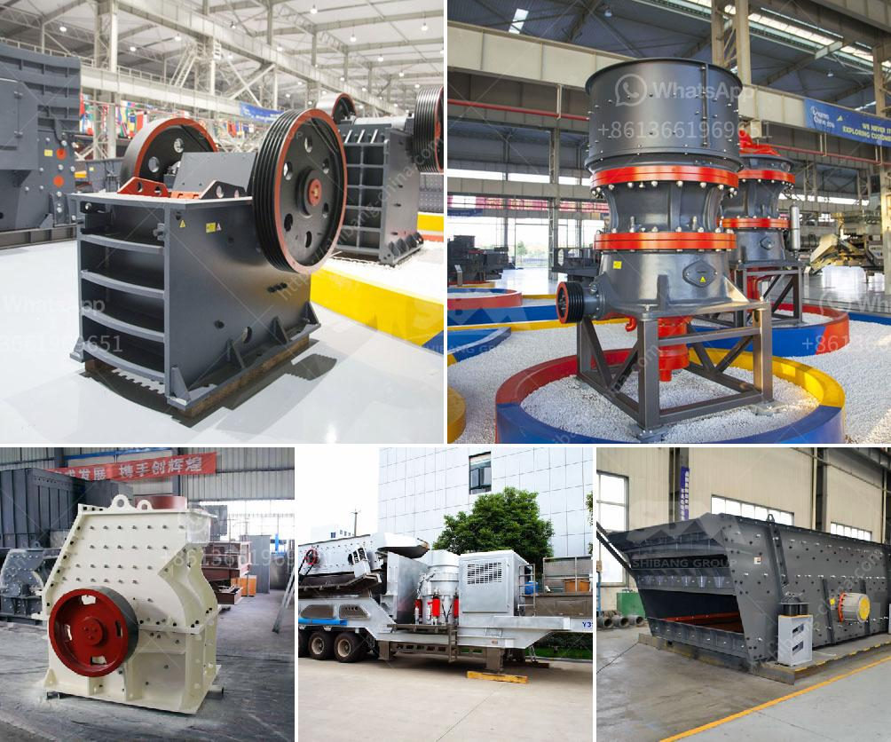

<h3>coal crusher machine capacity of 5 tons an hour</h3>
Coal is an essential resource for humanity's energy needs. It has been used for centuries to fuel various industries and power plants. However, in recent years, there has been growing concern about the environmental impact of burning coal. To address this issue, many coal power plants have been implementing cleaner technologies and more efficient machinery, such as the coal crusher machine with a capacity of 5 tons an hour.

The coal crusher machine is capable of grinding coal into small pieces, which makes them more suitable for burning. This machine is equipped with advanced technologies that ensure smooth operation, high production capacity, and low energy consumption. The high capacity of the machine allows it to handle a large amount of coal within a short period, reducing downtime and increasing productivity.

One notable feature of the coal crusher machine is its ability to produce uniform-sized coal particles. This ensures that the coal burns evenly, resulting in improved combustion efficiency and reduced emissions. Moreover, the machine can adjust the size of the coal particles according to the specific needs of the user, making it versatile and adaptable to various applications.

In terms of maintenance, the coal crusher machine is designed to be durable and long-lasting. It is equipped with robust components that can withstand heavy-duty use, reducing the need for frequent repairs or replacements. Additionally, the machine is designed for easy access to components, simplifying the maintenance process and saving time.

The coal crusher machine with a capacity of 5 tons an hour is an economical and environmentally friendly solution for coal power plants. It has the high efficiency, low noise, and low energy consumption characteristics that can save coal companies a lot of investment costs. With a compact structure, convenient maintenance, and simple operation, it is favored by many coal mining enterprises.

In conclusion, the coal crusher machine with a capacity of 5 tons an hour is an essential equipment in the coal mining process. It is necessary for coal mining companies to purchase and use this equipment to improve efficiency and productivity, reduce maintenance costs, and contribute to environmental protection.
<h3>Contact us</h3><ul><li><strong>Whatsapp:&nbsp;<a href="https://wa.me/8613661969651">+8613661969651</a></strong></li><li><a href="https://swt.shibang-china.com/?git&amp;zhl&amp;coal crusher machine capacity of 5 tons an hour"><strong>Online Service(chat now)</strong></a></li></ul><h3>Related</h3><ul><li><a href='jaw crusher plant for sale.md'>jaw crusher plant for sale</a></li><li><a href='kaolin crusher machine.md'>kaolin crusher machine</a></li><li><a href='rock gypsum buyers in china.md'>rock gypsum buyers in china</a></li><li><a href='jaw crusher manufacturers.md'>jaw crusher manufacturers</a></li><li><a href='crusher in pakistan.md'>crusher in pakistan</a></li></ul>