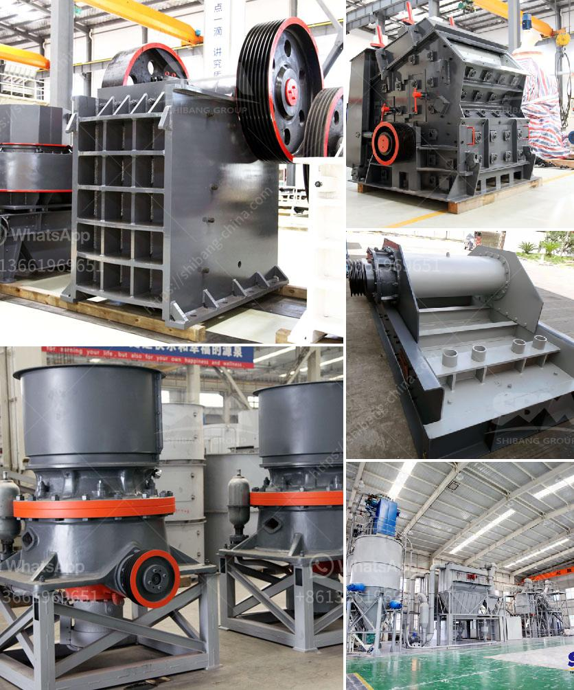

<h3>coal crusher manufacturing machine</h3>
Coal crusher is the flagship product of Aimix, a coal crushing equipment manufacturer in China, and it mainly specializes in coal crushers, coal pulverizers, coal mills and other related equipment. To ensure the normal operation of coal crusher manufacturing, Aimix has developed and manufactured coal crushers with the following specifications:

The coal crusher is powered by electromotor. Through belt drive, the vibrating feeder feeds the coal into coal crusher evenly and continuously.

There are several types of coal crushers, including coal jaw crusher, coal hammer crusher, coal impact crusher, coal double roller crusher, and coal vertical combination crusher. Coal crusher manufacturers have a wealth of experience and the most advanced technology.

Different types of coal crusher are suitable for different types of raw materials. For example, coal gangue and coke need to be crushed with a hammer crusher; brittle materials like coal powder and coal ash need to be processed by a coal mill. Similarly, coal can also be crushed in other crushers, such as coal cone crusher and coal impact crusher.

To meet the different requirements of customers, Aimix's coal crusher machine has many specifications. The coal crusher machine is suitable for all kinds of raw materials whose compressive strength is less than 320MPa.

SBM® is a professional coal jaw crusher machine manufacturer from China and it can provide the high quality machines for worldwide clients.

SBM's coal jaw crusher machine is suitable for crushing all kinds of medium hard ore or stone materials. It is widely used in various industries, such as mining, smelting, road and railway construction, chemical industry, etc.

This machine is suitable for coal crushing, gangue crushing, construction waste crushing and other industries. The feeding size of the machine is less than 100 mm and the finished product size is adjustable. Aimix specializes in the production of high-quality crushing equipment. In addition to coal crusher machines, Aimix offers many types of crushers and other related equipment, including jaw crusher machines, impact crusher machines, cone crusher machines, hammer crusher machines, and sand making machines.

Also, Aimix provides related construction machinery to clients, such as concrete batching plants, concrete mixers, and concrete pumps, both for commercial and residential projects.

If you are in need of a coal crusher machine, don't hesitate to choose Aimix. To meet your various needs, our coal crusher machines also have various specifications. Coal crusher machine, for sale or rent, we are here to provide professional information about coal crusher machines. Please contact us online or send us an email, we will give you a reply promptly.
<h3>Contact us</h3><ul><li><strong>Whatsapp:&nbsp;<a href="https://wa.me/8613661969651">+8613661969651</a></strong></li><li><a href="https://swt.shibang-china.com/?git&amp;zhl&amp;coal crusher manufacturing machine"><strong>Online Service(chat now)</strong></a></li></ul><h3>Related</h3><ul><li><a href='3 stamp gold mill pictures.md'>3 stamp gold mill pictures</a></li><li><a href='rock screening plants.md'>rock screening plants</a></li><li><a href='cement industries ball coal mill.md'>cement industries ball coal mill</a></li><li><a href='stone crushers for sale in kenya.md'>stone crushers for sale in kenya</a></li><li><a href='mobile diamond washing plant for sale.md'>mobile diamond washing plant for sale</a></li></ul>