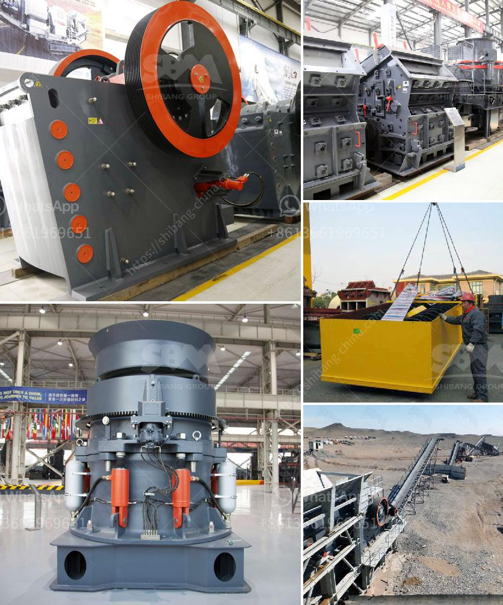

<h3>coal crushing and screening plants</h3>
Coal crushing and screening plants are crucial to the mining industry. They are used to separate valuable coal from waste materials and make it easier to transport. In most cases, crushing and screening plants are part of a larger system that includes heavy machinery, such as earth movers, dump trucks, and excavators.

The purpose of coal crushing and screening plants is to reduce the size of the coal and remove impurities. The plant uses a combination of different machines, such as jaw crushers, screening equipment, and various conveyors, to crush and separate the coal into useful sizes. Depending on the size of the coal, different types of crushers can be used, such as hammer mills, impact crushers, or roll crushers.

Once the coal is crushed and screened, it is ready for transportation. In some cases, the crushed coal is loaded directly onto trains or trucks for delivery to power plants or industrial consumers. In other cases, the coal is stockpiled for future use or further processing.

Coal crushing and screening plants play a crucial role in the mining industry, as they help separate valuable coal from waste materials. They also reduce the size of coal particles, making it easier and more cost-effective to transport. These plants utilize different types of crushers and screening equipment to achieve the desired size and quality of coal. As the demand for energy continues to increase, coal crushing and screening plants will remain essential for the mining industry.
<h3>Contact us</h3><ul><li><strong>Whatsapp:&nbsp;<a href="https://wa.me/8613661969651">+8613661969651</a></strong></li><li><a href="https://swt.shibang-china.com/?git&amp;zhl&amp;coal crushing and screening plants"><strong>Online Service(chat now)</strong></a></li></ul><h3>Related</h3><ul><li><a href='operation and operation of a jaw crusher.md'>operation and operation of a jaw crusher</a></li><li><a href='50tpd mini cement plant cost in india.md'>50tpd mini cement plant cost in india</a></li><li><a href='closed quarrz plants in kenya.md'>closed quarrz plants in kenya</a></li><li><a href='crushers made in south philippines.md'>crushers made in south philippines</a></li><li><a href='hammer mills for stone.md'>hammer mills for stone</a></li></ul>