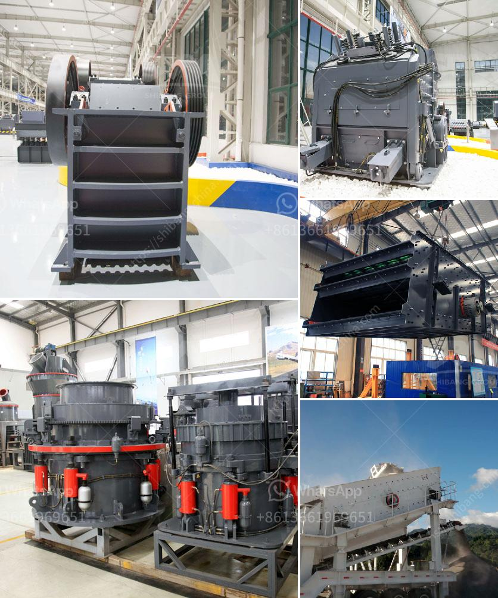

<h3>coal fine pelletizing machine manufacturer india</h3>
Coal is one of the most widely used sources of energy in many countries, especially in India. Coal fine pelletizing is the process of compressing coal fines into a solid form for use in combustion processes like power generation. In recent years, there has been an increased demand for coal fine pelletizing machines in India, and several manufacturers have emerged to meet this demand.

One of the leading coal fine pelletizing machine manufacturers in India is Jay Khodiyar Group. They have been in the industry for over two decades and have gained a reputation for producing high-quality machines that are both efficient and reliable. Their machines are designed to convert coal fines, which are usually considered waste, into value-added products.

The coal fine pelletizing machines manufactured by Jay Khodiyar Group have several key features that set them apart from their competitors. Firstly, their machines are highly automated, which means that they require minimal human intervention, reducing the chances of errors and increasing overall productivity. The machines also have a high capacity, allowing for the production of large quantities of coal pellets in a short amount of time.

Another notable feature of the coal fine pelletizing machines from Jay Khodiyar Group is their energy efficiency. These machines are designed to minimize energy consumption, making them not only cost-effective but also environmentally friendly. This is an important aspect, given the increasing global concern for sustainable energy solutions and the reduction of carbon emissions.

Furthermore, Jay Khodiyar Group offers excellent after-sales service and technical support to its customers. They have a team of skilled technicians who are available to assist with any issues that may arise with their machines. This ensures that their customers can continue to operate their machines efficiently and effectively, without any disruptions.

The demand for coal fine pelletizing machines in India is driven by several factors. Firstly, there is a growing need for cleaner and more efficient energy sources, and coal pellets offer an alternative to traditional coal combustion. Secondly, the use of coal pellets can help reduce coal waste, which is a major environmental concern in many coal-rich regions.

The coal fine pelletizing machines manufactured by Jay Khodiyar Group are not only suitable for large-scale industrial applications but also for smaller operations. This versatility makes them a preferred choice among a wide range of customers, including power plants, steel mills, and even individual coal suppliers.

In conclusion, the demand for coal fine pelletizing machines is on the rise in India, and manufacturers like Jay Khodiyar Group are leading the way with their high-quality and efficient machines. With their advanced features, energy efficiency, and excellent after-sales service, they have gained a strong foothold in the industry. As the demand for cleaner and more sustainable energy sources continues to grow, coal fine pelletizing machines will play a crucial role in meeting these needs.
<h3>Contact us</h3><ul><li><strong>Whatsapp:&nbsp;<a href="https://wa.me/8613661969651">+8613661969651</a></strong></li><li><a href="https://swt.shibang-china.com/?git&amp;zhl&amp;coal fine pelletizing machine manufacturer india"><strong>Online Service(chat now)</strong></a></li></ul><h3>Related</h3><ul><li><a href='malaysia ball mill.md'>malaysia ball mill</a></li><li><a href='mobile stone crusher machine europa.md'>mobile stone crusher machine europa</a></li><li><a href='slag processing plant details.md'>slag processing plant details</a></li><li><a href='barite grinding companies.md'>barite grinding companies</a></li><li><a href='company mobile crushers.md'>company mobile crushers</a></li></ul>